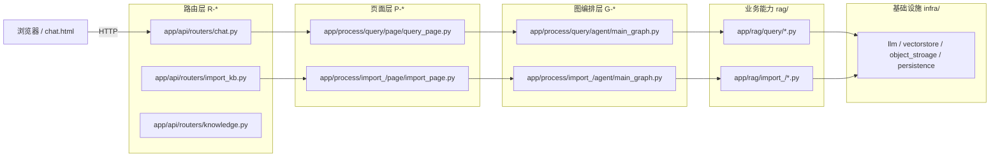

# 汽车售后智能诊断与报修知识助手

> **项目定位**：面向比亚迪商用车售前售后一体化场景，基于 RAG 技术构建的智能售后诊断、知识问答与报修辅助系统。

---

## 项目文档结构

```
auto-carcrm/
├── README.md                        # 项目总览（本文件）
│
├── app/                             # 后端服务统一入口
│   └── main.py                      # FastAPI 唯一启动入口（python app/main.py）
│
├── docs/                            # 项目开发文档
│   ├── 01_项目概述/
│   │   └── 01_项目背景与目标.md
│   ├── 02_需求说明/
│   │   ├── 01_用户角色与权限设计.md
│   │   ├── 02_功能需求总览.md
│   │   └── 03_核心功能详细说明.md
│   ├── 03_架构设计/
│   │   ├── 01_系统整体架构.md
│   │   └── 02_技术栈选型说明.md
│   ├── 04_数据库设计/
│   │   ├── 01_MongoDB集合设计.md
│   │   └── 02_状态State枚举设计.md
│   ├── 05_接口设计/
│   │   └── 01_FastAPI接口文档.md
│   ├── 06_技术笔记/
│   │   └── 01_RAG实战技术复盘笔记.md
│   └── 07_后端落地文档_app目录与运行指南.md   # 入口/启动/分层详解
│
└── flows/                           # 流程图文档（Mermaid格式）
    ├── 00_流程图总索引.md
    ├── 01_数据导入流程/
    │   ├── 01_知识导入总流程.md
    │   └── 02_文档状态流转图.md
    ├── 02_RAG检索流程/
    │   ├── 01_多路混合检索流程.md
    │   ├── 02_RAG生成回答流程.md
    │   └── 03_无答案与补充提问流程.md
    ├── 03_业务流程/
    │   ├── 01_整体业务架构流程.md
    │   ├── 02_角色分工流程.md
    │   ├── 03_终端客户业务主流程.md
    │   ├── 04_多轮对话上下文流程.md
    │   ├── 05_智能诊断流程.md
    │   ├── 06_质保预判流程.md
    │   ├── 07_保养判断流程.md
    │   ├── 08_智能报修流程.md
    │   └── 09_案例沉淀流程.md
    └── 04_状态流转/
        ├── 01_知识文档状态流转.md
        └── 02_报修单状态流转.md
```

> **`app/` 主目录说明**（五层划分）：`api/`（路由 + Schema） → `core/`（依赖/响应/异常） → `domain/`（业务服务） → `infra/`（LLM/向量库/MinIO/仓库） → `process/{import_,query}/`（页面 + 图编排 + RAG 节点）。详见 `docs/07_后端落地文档_app目录与运行指南.md`。

---

## 项目核心价值

| 维度 | 价值说明 |
|---|---|
| **业务价值** | 降低售后知识查询成本，提升服务口径一致性，沉淀典型案例 |
| **用户价值** | 车主自助诊断、智能报修、质保预判，减少无效跑服务站 |
| **产品价值** | CRM从数据记录工具升级为智能业务辅助平台 |
| **技术价值** | 完整 RAG 闭环：文档接入→检索→生成→评估→优化 |

---

## 核心技术栈

| 组件 | 技术选型 | 说明 |
|---|---|---|
| 后端框架 | Python 3.11 + FastAPI | 统一入口 `app/main.py` 挂载路由/中间件/异常 |
| 异步任务 | BackgroundTasks / Celery（可选） | 文档解析、嵌入生成等耗时任务后台调度 |
| 数据库 | MongoDB | 文档/业务/历史/审计多集合，详见 `docs/04_数据库设计/` |
| 向量检索 | Milvus（BGE-M3 Embedding） | `app/infra/vectorstore/milvus_gateway.py` |
| 对象存储 | MinIO | PDF/图片/产物存储，`app/infra/object_stroage/minio_gateway.py` |
| 文档解析 | MinerU（PDF2MD） | `app/infra/document_parse/mineru_gateway.py` |
| RAG 编排 | LangChain + LangGraph | 图编排 `app/process/*/agent/main_graph.py` |
| 文本 LLM | **小米 mimo** `mimo-v2.5-pro` | OpenAI 兼容接口（token-plan 端点） |
| 视觉 LLM | **小米 mimo** `mimo-v2-omni` | 多模态、可有可无（`VL_ENABLED` 总开关） |
| Embedding 模型 | bge-m3 | 中文检索友好 |
| 缓存 | Redis（可选） | 会话历史/限流/热缓存 |
| 部署 | Docker + Nginx | 生产推荐 |

---

## 快速开始

```bash
# 1. 准备环境（Python 3.11）
python -m venv .venv
.venv\Scripts\activate           # Windows
pip install -r requirements.txt  # 或 uv sync

# 2. 启动 Mongo / Milvus / MinIO（如使用 docker-compose）

# 3. 配置环境变量（复制 .env.example 为 .env 并填写）
copy .env.example .env

# 4. 一键启动后端服务（统一入口 app/main.py）
python app/main.py
# 访问 http://localhost:8000/docs 查看 OpenAPI 文档
```

> **`app/main.py` 是唯一启动入口**：负责拉起 FastAPI 应用、挂载所有 routers、注册中间件/异常处理/生命周期。

---

## 分层架构（三层调用链）



> **从外到内**：`HTTP → R-* (router) → P-* (page) → G-* (graph) → RAG-* (节点) → LLM/向量库/外部服务`
> 详见 `flows/00_流程图总索引.md` 与 `docs/07_后端落地文档_app目录与运行指南.md`。

---

## 系统角色

| 角色 | 端 | 核心职责 |
|---|---|---|
| 终端客户/司机/车队 | C端 | 咨询、自助诊断、报修、查进度 |
| 经销商/服务站 | B端 | 接单、检测、维修、提交案例 |
| 厂家/管理员 | 管理端 | 上传知识、审核发布、技术支持、分析优化 |

---

## 快速导航

- [项目背景与目标](docs/01_项目概述/01_项目背景与目标.md)
- [用户角色与权限设计](docs/02_需求说明/01_用户角色与权限设计.md)
- [功能需求总览](docs/02_需求说明/02_功能需求总览.md)
- [系统整体架构](docs/03_架构设计/01_系统整体架构.md)
- [技术栈选型说明](docs/03_架构设计/02_技术栈选型说明.md)
- [MongoDB集合设计](docs/04_数据库设计/01_MongoDB集合设计.md)
- [FastAPI接口文档](docs/05_接口设计/01_FastAPI接口文档.md)
- [RAG实战技术复盘笔记](docs/06_技术笔记/01_RAG实战技术复盘笔记.md)
- [后端落地：app 目录与运行指南](docs/07_后端落地文档_app目录与运行指南.md)
- [流程图总索引](flows/00_流程图总索引.md)

---

## 开发阶段规划

| 阶段 | 目标 | 优先级 |
|---|---|---|
| **第一阶段 MVP** | 售后知识导入 + RAG问答 + 引用溯源 | P0 |
| **第二阶段** | 智能诊断 + 质保预判 + 智能报修 | P0 |
| **第三阶段** | 典型案例沉淀 + 维修工单接入 | P1 |
| **第四阶段** | 售前销售问数 + 拜访分析 | P1 |
| **第五阶段** | 售前售后一体化智能助手 | P2 |

---

*文档版本：v1.1 | 更新时间：2026-06-12*

> 变更说明（v1.1）：增补「快速开始 / 分层架构 / app 主目录」小节；技术栈切到小米 mimo（`mimo-v2.5-pro` 文本 / `mimo-v2-omni` 视觉）；新增对 `docs/07_后端落地文档_app目录与运行指南.md` 的导航引用。
