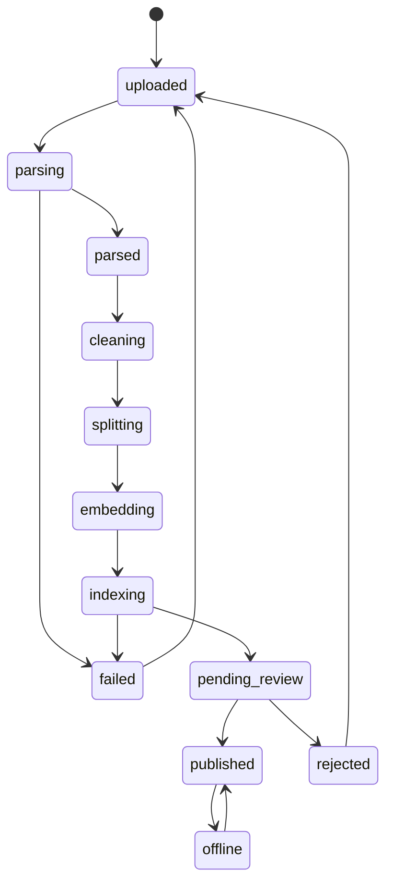
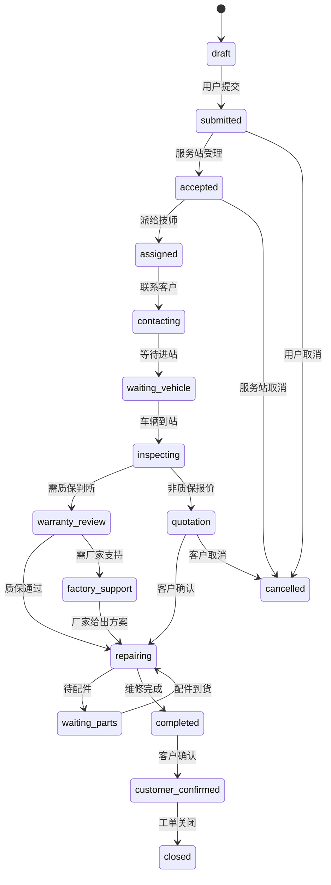

# 状态 State 枚举设计

> 文档编号：DOC-04-02 | 版本：v1.0 | 更新时间：2026-06-12

---

## 一、状态设计原则

1. **状态是业务流程的快照**：每个状态代表业务对象在生命周期中的一个确定位置
2. **状态转换必须有明确触发条件**：不允许随意跳转，必须按流程图定义的路径推进
3. **终态不可逆**（通常）：deleted / closed / scrapped 等终态一般不再流转
4. **中间状态需要超时保护**：parsing / indexing / generating 等中间态需设置超时自动失败

---

## 二、各集合状态枚举

### 2.1 用户状态（users.state）

| 状态值 | 中文名 | 触发条件 | 可转换到 |
|---|---|---|---|
| `active` | 正常 | 注册成功/管理员激活 | disabled, deleted |
| `disabled` | 停用 | 管理员操作 | active, deleted |
| `deleted` | 已删除 | 管理员操作（软删除） | — |

```
[注册] → active → disabled → active
                           → deleted
         active → deleted
```

---

### 2.2 车辆状态（vehicles.state）

| 状态值 | 中文名 | 触发条件 | 可转换到 |
|---|---|---|---|
| `active` | 正常使用 | 车辆绑定/交付 | repairing, scrapped, transferred, inactive |
| `repairing` | 维修中 | 报修单受理 | active |
| `scrapped` | 已报废 | 车辆报废申请 | — |
| `transferred` | 已过户 | 过户操作 | — |
| `inactive` | 停用 | 管理员操作 | active |

```
[绑定] → active ⇄ repairing
         active → scrapped（终态）
         active → transferred（终态）
         active ⇄ inactive
```

---

### 2.3 知识文档状态（knowledge_documents.state）

| 状态值 | 中文名 | 触发条件 | 可转换到 |
|---|---|---|---|
| `uploaded` | 已上传 | 文件上传成功 | parsing |
| `parsing` | 解析中 | 触发解析任务 | parsed, failed |
| `parsed` | 解析完成 | 解析任务成功 | indexing |
| `cleaning` | 清洗中 | 进入文本清洗 | splitting |
| `splitting` | 切分中 | 进入文本切分 | embedding |
| `embedding` | 向量化中 | 进入Embedding | indexing |
| `indexing` | 索引构建中 | 进入索引写入 | pending_review, failed |
| `pending_review` | 待审核 | 索引完成等待审核 | published, rejected |
| `published` | 已发布 | 审核通过 | offline |
| `rejected` | 已驳回 | 审核驳回 | uploaded |
| `offline` | 已下线 | 管理员手动下线 | published |
| `failed` | 处理失败 | 解析/索引任务失败 | uploaded |



---

### 2.4 知识片段状态（knowledge_chunks.state）

| 状态值 | 中文名 | 说明 |
|---|---|---|
| `active` | 可检索 | 文档发布后，Chunk 可被向量检索命中 |
| `inactive` | 不可检索 | 文档下线后，Chunk 暂停检索 |
| `reindexing` | 重新索引中 | 更新 Embedding 或元数据时的中间状态 |
| `deleted` | 已删除 | 文档删除或重新导入时软删除旧 Chunk |

```
[向量写入] → active ⇄ inactive（文档下线/上线）
             active → reindexing → active（重新索引）
             active/inactive → deleted（文档删除）
```

---

### 2.5 导入任务状态（import_tasks.task_state）

| 状态值 | 中文名 | 说明 |
|---|---|---|
| `pending` | 等待处理 | 任务已创建，等待队列调度 |
| `running` | 处理中 | 任务正在执行 |
| `success` | 成功 | 所有 Chunk 处理成功 |
| `partial_success` | 部分成功 | 部分 Chunk 处理失败，其余成功 |
| `failed` | 失败 | 任务整体失败 |
| `cancelled` | 已取消 | 手动取消 |
| `timeout` | 超时 | 超过最大执行时间 |

```
[创建] → pending → running → success（终态）
                           → partial_success（终态）
                           → failed（终态）
                           → timeout（终态）
         pending → cancelled（终态）
```

---

### 2.6 诊断会话状态（diagnosis_sessions.state）

| 状态值 | 中文名 | 触发条件 |
|---|---|---|
| `started` | 已开始 | 用户发起诊断 |
| `collecting_info` | 信息补充中 | 系统追问，等待用户补充 |
| `diagnosing` | 诊断中 | 检索和生成诊断结果 |
| `completed` | 诊断完成 | 已输出诊断结果 |
| `converted_to_order` | 已转报修 | 用户确认报修 |
| `cancelled` | 已取消 | 用户主动退出 |
| `failed` | 诊断失败 | 系统错误或无法诊断 |

```
[发起] → started → collecting_info ⇄ diagnosing
         started → diagnosing → completed → converted_to_order（终态）
                                completed（用户不报修，自然结束）
         任意状态 → cancelled（终态）
         diagnosing → failed（终态）
```

---

### 2.7 报修单状态（repair_orders.state）⭐ 最重要

| 状态值 | 中文名 | 操作方 | 触发条件 |
|---|---|---|---|
| `draft` | 草稿 | 系统自动 | 系统生成报修单草稿 |
| `submitted` | 已提交 | 终端客户 | 用户确认提交 |
| `accepted` | 已受理 | 服务顾问 | 服务站接单 |
| `assigned` | 已派单 | 服务顾问 | 分配给维修技师 |
| `contacting` | 联系客户中 | 服务顾问/技师 | 确认车辆情况 |
| `waiting_vehicle` | 等待车辆进站 | 系统/服务站 | 等待客户送车或救援 |
| `inspecting` | 检测中 | 维修技师 | 开始车辆检测 |
| `warranty_review` | 质保审核中 | 服务顾问/工程师 | 判断是否属于质保 |
| `factory_support` | 厂家技术支持中 | 售后工程师 | 升级至厂家处理 |
| `quotation` | 报价中 | 服务顾问 | 非质保项目报价 |
| `repairing` | 维修中 | 维修技师 | 开始维修 |
| `waiting_parts` | 待配件 | 服务站 | 等待配件到货 |
| `completed` | 维修完成 | 维修技师 | 维修完成等待客户确认 |
| `customer_confirmed` | 客户已确认 | 终端客户 | 客户确认维修完成 |
| `closed` | 已关闭 | 系统自动/服务站 | 工单正常结束 |
| `cancelled` | 已取消 | 终端客户/服务站 | 取消报修 |



---

### 2.8 问答回答状态（qa_messages.answer_state）

| 状态值 | 中文名 | 说明 |
|---|---|---|
| `generating` | 生成中 | LLM 正在生成（流式输出用） |
| `success` | 成功 | 答案正常生成 |
| `no_context` | 无足够依据 | 检索未命中足够资料 |
| `model_failed` | 模型调用失败 | LLM API 错误 |
| `blocked` | 被拦截 | 触发安全规则或敏感词 |
| `timeout` | 超时 | 超过最大响应时间 |
| `need_more_info` | 需要补充信息 | 需要用户提供更多信息 |

---

### 2.9 质保预判结果（repair_orders.warranty_precheck.result）

| 状态值 | 中文名 | 说明 |
|---|---|---|
| `likely_in_warranty` | 初步判断可能在保 | 时间、里程、保养均满足条件 |
| `likely_out_of_warranty` | 初步判断可能超保 | 超出时间或里程限制 |
| `manual_review_required` | 需要人工复核 | 条件边缘或有免责风险 |
| `insufficient_info` | 信息不足无法判断 | 缺少车辆档案或保养记录 |

> ⚠️ **重要设计原则**：质保预判结果只是**初步预判**，不是最终结论。系统不得使用 `in_warranty` 或 `out_of_warranty` 等绝对表述。最终质保结论以服务站检测后提交的 `warranty_final_result` 字段为准。

---

### 2.10 典型案例状态（typical_cases.state）

| 状态值 | 中文名 | 说明 |
|---|---|---|
| `draft` | 草稿 | 技师/服务顾问提交待审 |
| `pending_review` | 待审核 | 等待售后工程师审核 |
| `published` | 已发布 | 审核通过，可被检索 |
| `rejected` | 已驳回 | 审核驳回，退回修改 |
| `offline` | 已下线 | 手动下线 |

---

## 三、状态变更日志设计

重要业务对象（报修单、知识文档）需要记录状态变更历史，建议使用嵌套数组。

```json
"state_history": [
  {
    "state": "submitted",
    "time": "2026-06-12T10:55:00",
    "operator_id": "U10001",
    "operator_name": "张三",
    "comment": "用户提交报修"
  },
  {
    "state": "accepted",
    "time": "2026-06-12T11:02:00",
    "operator_id": "U20001",
    "operator_name": "服务顾问李四",
    "comment": "受理报修，安排下午14:00检测"
  }
]
```

---

*文档版本：v1.0 | 更新时间：2026-06-12*
