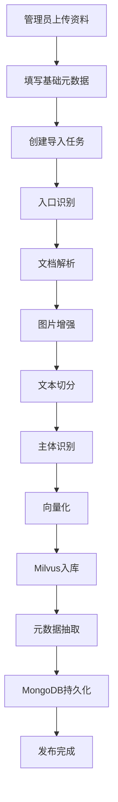

# 知识导入总流程

> 流程编号：FLOW-01-01 | 版本：v1.2 | 更新时间：2026-06-13

**流程说明**：本流程描述厂家或管理员将售后资料上传后，经过解析、切分、向量化、入库、元数据抽取、持久化和发布的完整离线知识导入链路。

---

## Typora 兼容版流程图

---

## 当前代码真实顺序

1. `entry_service.py`
2. `pdf_parse_service.py`
3. `enrich_markdown_images.py`
4. `split_service.py`
5. `item_name_service.py`
6. `embedding_service.py`
7. `index_service.py`
8. `doc_meta_service.py`
9. `knowledge_persist_service.py`

---

## 各阶段说明

### 1. 入口识别
- 文件：`app/rag/import_/entry_service.py`
- 作用：识别文件类型，决定导入链路入口

### 2. 文档解析
- 文件：`app/rag/import_/pdf_parse_service.py`
- 作用：把 PDF 或其他文档转换为可处理文本/Markdown

### 3. 图片增强
- 文件：`app/rag/import_/enrich_markdown_images.py`
- 作用：补充图片说明，增强后续切分与理解效果

### 4. 文本切分
- 文件：`app/rag/import_/split_service.py`
- 作用：将长文档切成适合检索的知识片段

### 5. 主体识别
- 文件：`app/rag/import_/item_name_service.py`
- 作用：识别当前文档归属的主体名称

### 6. 向量化
- 文件：`app/rag/import_/embedding_service.py`
- 作用：为 chunks 生成 dense / sparse 混合向量

### 7. Milvus 入库
- 文件：`app/rag/import_/index_service.py`
- 作用：将知识切片写入 Milvus 向量库

### 8. 元数据抽取
- 文件：`app/rag/import_/doc_meta_service.py`
- 作用：抽取车型、版本、日期、文档类型等元信息

### 9. MongoDB 持久化
- 文件：`app/rag/import_/knowledge_persist_service.py`
- 作用：写入知识文档主记录并更新发布状态

---

## 说明

1. 上述顺序与 `app/process/import_/agent/main_graph.py` 的实际编排顺序保持一致。
2. 该流程图为 Typora 兼容版，省略了过细的展示层与审计细节。
3. 若后续增加 OCR、Excel 专项处理、扫描件专用链路，可在本图继续扩展。

---

*流程版本：v1.2 | 更新时间：2026-06-13*
