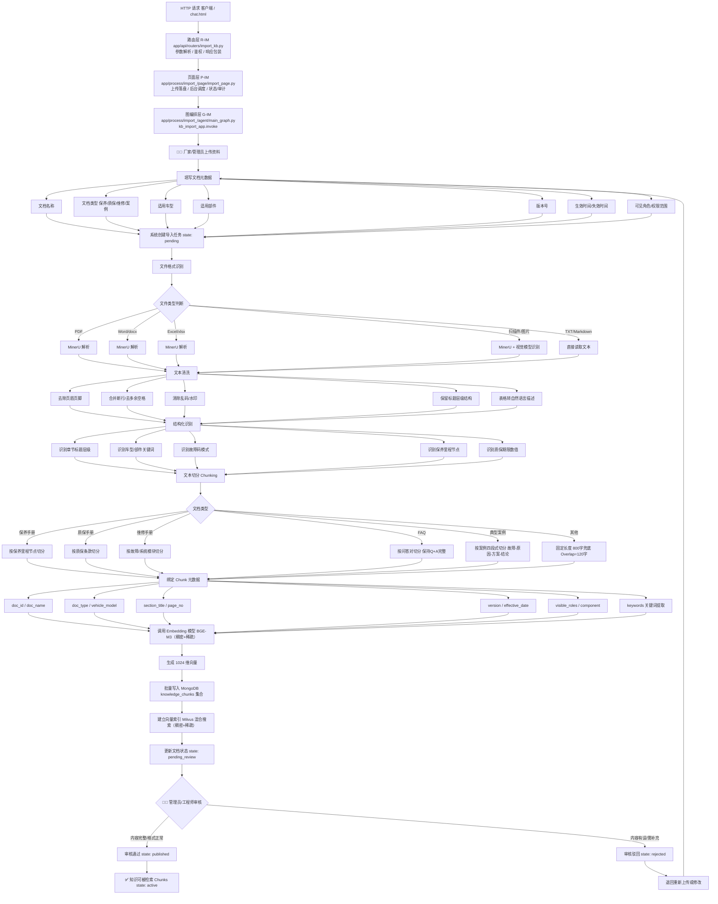

# 知识导入总流程

> 流程编号：FLOW-01-01 | 版本：v1.1 | 更新时间：2026-06-12

**流程说明**：本流程为离线知识入库链路，描述厂家/管理员将保养手册、质保手册、维修手册、典型案例等售后资料从上传到发布的完整处理过程。

---

## 完整流程图



---

## 关键节点说明

### R-IM 路由层（`app/api/routers/import_kb.py`）
- 路由定义：
  - `POST /api/v1/knowledge/upload` （文件上传）
  - `GET  /api/v1/knowledge/status/{task_id}` （任务状态查询）
  - `GET  /api/v1/knowledge/html` （导入测试页）
- 职责：**只做** HTTP 边界处理——参数解析、用户鉴权、调用 page 层、响应包装；**不接触** LangGraph / LangChain / 向量库。
- 调用页面层单例：`from app.process.import_.page.import_page import import_page`

### P-IM 页面层（`app/process/import_/page/import_page.py`）
- 入口方法：`ImportPage.upload_and_invoke(files, background_tasks, user_id)`
- 职责：
  1. 将上传文件流式落盘到 `output/<时间戳>/<task_id>/`
  2. 调用 `task_utils` 初始化任务状态
  3. 通过 `background_tasks.add_task(_invoke_graph, ...)` 异步触发图执行
  4. （TODO 业务点）调用 `domain/case_service` 写入审计 / `minio_gateway` 归档 / `knowledge_repository` 落库
- 出口方法：`ImportPage.get_status(task_id)` 查 in-memory 状态

### G-IM 图编排层（`app/process/import_/agent/main_graph.py`）
- LangGraph 编译产物：`kb_import_app`（`StateGraph` 编译后实例）
- 由 page 层 `_invoke_graph()` 通过 `kb_import_app.invoke(state)` 调用
- 返回 final state 后，page 层再 `update_task_status(task_id, COMPLETED/FAILED)`

### RAG-01 文档上传
- 支持格式：PDF / Word / Excel / TXT / Markdown / 图片扫描件
- 必填元数据：doc_name、doc_type、vehicle_model、version、effective_date
- 文档状态初始化为 `uploaded`

### RAG-04 文档解析
- PDF 解析需处理多栏排版、页眉页脚干扰
- Excel 表格解析需转为自然语言，不能直接拼接单元格
- 扫描件需 OCR，OCR 置信度低时需人工复核

### RAG-07 Chunk 切分（最关键节点）
- FAQ 文档：必须保持问答对完整，不能把问题和答案拆到不同 Chunk
- 典型案例：按"故障现象-原因分析-处理方案-维修结论"四段式切分
- 质保手册：尽量保持一条质保规则在同一 Chunk 中，避免条件和结论被拆开
- 长段兜底：chunk_size=800, overlap=120

### RAG-08 元数据绑定
关键元数据必须在 Chunk 级别绑定，而不只在文档级别：

```json
{
  "metadata": {
    "vehicle_model": "T5",
    "component": "动力电池",
    "doc_type": "warranty_manual",
    "version": "v1.0",
    "effective_date": "2026-01-01",
    "expire_date": "2027-01-01",
    "visible_roles": ["customer", "service_advisor"]
  }
}
```

### RAG-11 审核发布
- 发布后：knowledge_document.state → `published`，knowledge_chunks.state → `active`
- 驳回后：退回到 `uploaded` 状态，需重新上传或修改后重新导入
- 下线操作：knowledge_document.state → `offline`，knowledge_chunks.state → `inactive`

---

## 数据流转示意

```
原始文档文件（PDF/Word/Excel）
    ↓ 解析
原始文本（带噪声）
    ↓ 清洗
干净文本（带结构标记）
    ↓ 切分
Chunk 列表（500-800字/个）
    ↓ 向量化
(chunk_text, embedding[1024], metadata{}) 三元组
    ↓ 入库
MongoDB knowledge_chunks 集合
    ↓ 建索引
Milvus 混合搜索向量索引
    ↓ 审核发布
state: active，可被检索
```

---

*流程版本：v1.0 | 更新时间：2026-06-12*
