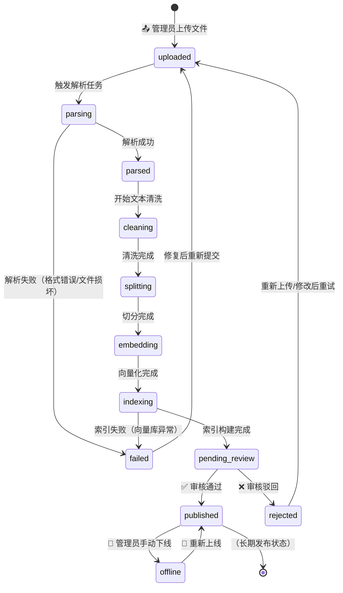
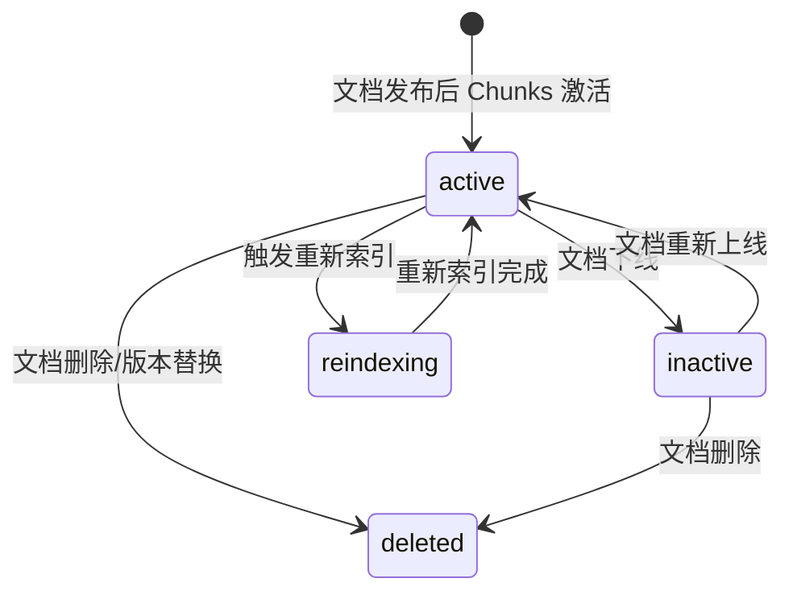
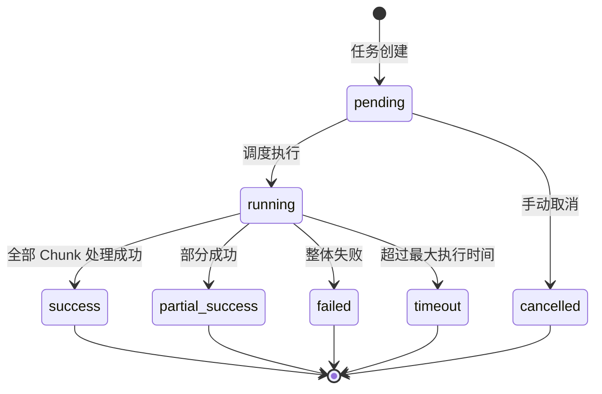

# 文档状态流转图

> 流程编号：FLOW-01-02 | 版本：v1.0 | 更新时间：2026-06-12

---

## 知识文档状态流转

---

## 状态枚举说明

| 状态值 | 中文名 | 触发方式 | 说明 |
|---|---|---|---|
| `uploaded` | 已上传 | 管理员上传文件 | 文件已存储，等待处理 |
| `parsing` | 解析中 | 系统自动/手动触发 | 正在提取文本内容 |
| `parsed` | 解析完成 | 系统自动 | 文本提取成功 |
| `cleaning` | 清洗中 | 系统自动 | 去噪、去页眉脚 |
| `splitting` | 切分中 | 系统自动 | Chunk 切分 |
| `embedding` | 向量化中 | 系统自动 | 调用 Embedding 模型 |
| `indexing` | 索引构建中 | 系统自动 | 写入向量数据库 |
| `pending_review` | 待审核 | 系统自动 | 等待人工审核 |
| `published` | 已发布 | 管理员审核通过 | Chunks 可被检索 |
| `rejected` | 已驳回 | 管理员审核驳回 | 退回修改 |
| `offline` | 已下线 | 管理员手动 | Chunks 不可检索 |
| `failed` | 处理失败 | 系统异常 | 需人工介入排查 |

---

## 知识片段（Chunk）状态流转

| Chunk 状态 | 含义 | 是否可被检索 |
|---|---|---|
| `active` | 激活 | ✅ 是 |
| `inactive` | 停用 | ❌ 否 |
| `reindexing` | 重新索引中 | ❌ 否（临时） |
| `deleted` | 已删除（软删除） | ❌ 否 |

---

## 导入任务状态流转

---

*流程版本：v1.0 | 更新时间：2026-06-12*
