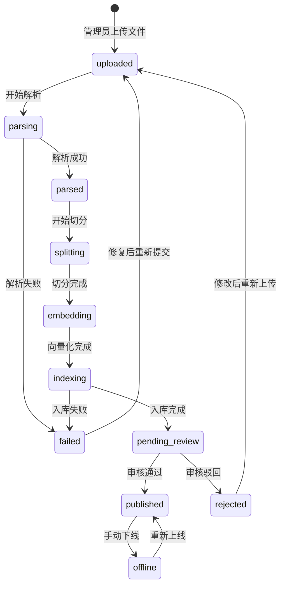
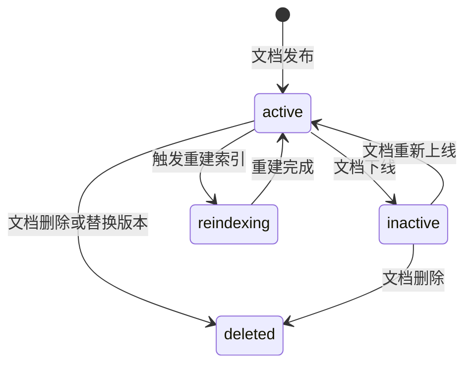
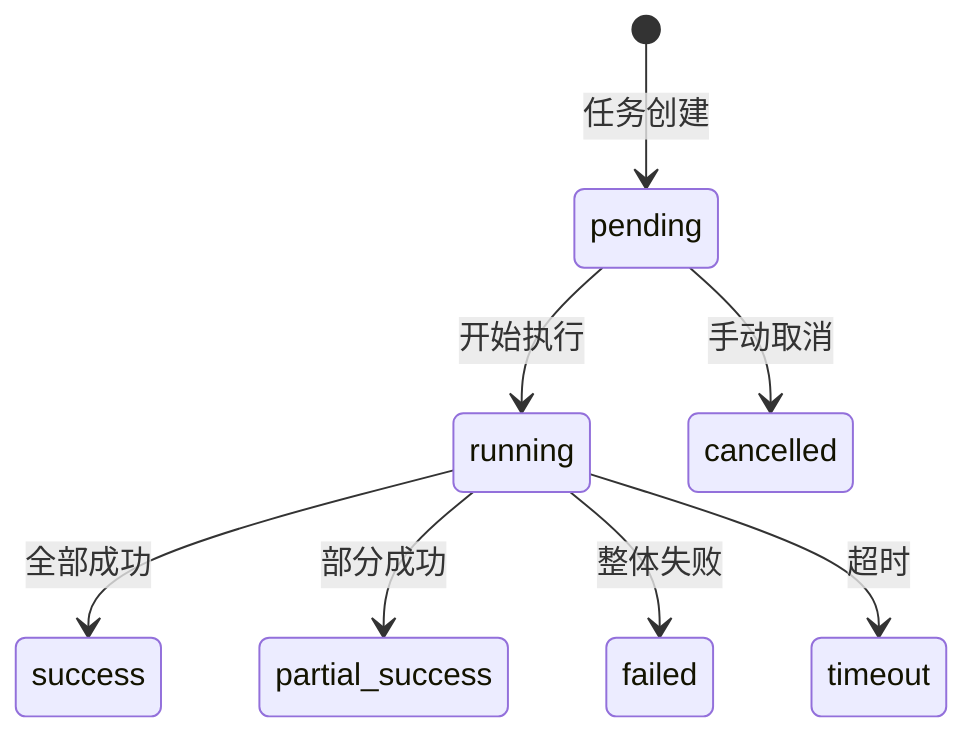

# 文档状态流转图

> 流程编号：FLOW-01-02 | 版本：v1.1 | 更新时间：2026-06-13

---

## 知识文档状态流转

---

## 状态枚举说明

| 状态值 | 中文名 | 触发方式 | 说明 |
|---|---|---|---|
| `uploaded` | 已上传 | 管理员上传文件 | 文件已接收，等待处理 |
| `parsing` | 解析中 | 系统自动 | 正在提取文本内容 |
| `parsed` | 解析完成 | 系统自动 | 原始内容提取成功 |
| `splitting` | 切分中 | 系统自动 | 正在做 Chunk 切分 |
| `embedding` | 向量化中 | 系统自动 | 正在生成向量 |
| `indexing` | 入库中 | 系统自动 | 正在写入向量数据库 |
| `pending_review` | 待审核 | 系统自动 | 等待人工审核 |
| `published` | 已发布 | 管理员审核通过 | 可参与检索 |
| `rejected` | 已驳回 | 管理员审核驳回 | 需要修改后重导 |
| `offline` | 已下线 | 管理员手动下线 | 暂不参与检索 |
| `failed` | 处理失败 | 系统异常 | 需人工排查 |

---

## 知识片段状态流转

| Chunk 状态 | 含义 | 是否可被检索 |
|---|---|---|
| `active` | 激活 | 是 |
| `inactive` | 停用 | 否 |
| `reindexing` | 重建索引中 | 临时不可检索 |
| `deleted` | 已删除 | 否 |

---

## 导入任务状态流转

---

*流程版本：v1.1 | 更新时间：2026-06-13*
