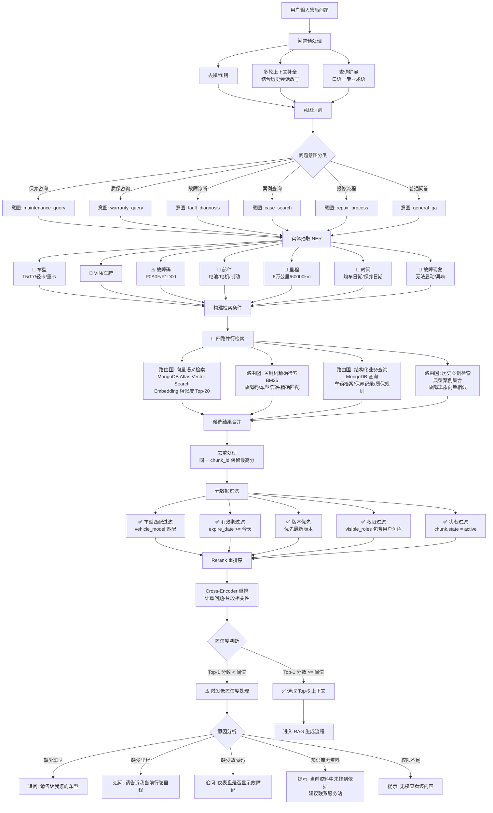

# 多路混合检索流程

> 流程编号：FLOW-02-01 | 版本：v1.0 | 更新时间：2026-06-12

**流程说明**：本流程为在线检索核心链路。采用四路并行召回策略，解决单一向量检索对精确关键词不敏感、对结构化业务数据无法覆盖的问题。

---

## 完整多路混合检索流程图



---

## 四路检索说明

### 路由1：向量语义检索

**适用场景**：用户描述口语化、模糊、不知道专业术语时

**技术实现**：
```python
async def vector_search(question: str, vehicle_model: str, user_role: str, top_k: int = 20):
    query_embedding = embedding_model.encode(question)
    
    pipeline = [
        {
            "$vectorSearch": {
                "index": "knowledge_chunks_vector_index",
                "path": "embedding",
                "queryVector": query_embedding.tolist(),
                "numCandidates": 100,
                "limit": top_k,
                "filter": {
                    "metadata.vehicle_model": vehicle_model,
                    "state": "active",
                    "metadata.visible_roles": user_role
                }
            }
        },
        {
            "$project": {
                "_id": 1,
                "chunk_text": 1,
                "metadata": 1,
                "score": {"$meta": "vectorSearchScore"}
            }
        }
    ]
    
    results = await db.knowledge_chunks.aggregate(pipeline).to_list(top_k)
    return results
```

**示例**：用户问"车子突然没劲" → 向量检索命中"动力系统故障"相关 Chunk

---

### 路由2：关键词精确检索（BM25）

**适用场景**：故障码、车型编号、部件名称、政策编号等精确术语

**技术实现**：
```python
from rank_bm25 import BM25Okapi

def keyword_search(question: str, vehicle_model: str, top_k: int = 10):
    # 从问题中提取关键词
    keywords = extract_keywords(question)
    
    # 在已加载的 BM25 索引中检索
    scores = bm25_index.get_scores(keywords)
    top_indices = scores.argsort()[-top_k:][::-1]
    
    return [chunks_cache[i] for i in top_indices if scores[i] > 0]
```

**示例**：用户问"P0A0F是什么意思" → 关键词检索精确命中包含"P0A0F"的故障码说明 Chunk

---

### 路由3：结构化业务查询

**适用场景**：需要结合个人车辆数据的问题（是否超保、是否需要保养）

**技术实现**：
```python
async def structured_query(question: str, vehicle_id: str):
    results = []
    
    # 查询车辆档案
    vehicle = await db.vehicles.find_one({"_id": vehicle_id})
    if vehicle:
        results.append({
            "type": "vehicle_info",
            "content": format_vehicle_info(vehicle)
        })
    
    # 查询保养记录
    maintenance = await db.maintenance_records.find(
        {"vehicle_id": vehicle_id}
    ).sort("maintenance_date", -1).limit(3).to_list(3)
    
    # 查询质保规则
    warranty = await db.warranty_policies.find_one({
        "vehicle_model": vehicle["vehicle_model"],
        "state": "active"
    })
    
    return results
```

**示例**：用户问"我的车还在保吗" → 查询车辆档案 + 保养记录 + 质保规则三张集合

---

### 路由4：历史案例检索

**适用场景**：用户想了解类似问题处理经验

**技术实现**：向量相似度检索 typical_cases 集合，按故障现象语义相似度匹配

**示例**：用户问"有没有类似无法启动的案例" → 检索典型案例集合中"故障现象=无法启动"相关案例

---

## 结果融合与打分

```python
def merge_results(vector_results, keyword_results, structured_results, case_results):
    score_map = {}
    
    for item in vector_results:
        chunk_id = str(item["_id"])
        score_map[chunk_id] = {
            "item": item,
            "vector_score": item.get("score", 0),
            "keyword_score": 0,
            "case_score": 0
        }
    
    for item in keyword_results:
        chunk_id = str(item["_id"])
        if chunk_id in score_map:
            score_map[chunk_id]["keyword_score"] = item.get("bm25_score", 0)
        else:
            score_map[chunk_id] = {
                "item": item,
                "vector_score": 0,
                "keyword_score": item.get("bm25_score", 0),
                "case_score": 0
            }
    
    # 加权融合（RRF 算法）
    for chunk_id, scores in score_map.items():
        scores["final_score"] = (
            0.6 * scores["vector_score"] +
            0.3 * scores["keyword_score"] +
            0.1 * scores["case_score"]
        )
    
    # 排序
    sorted_results = sorted(
        score_map.values(),
        key=lambda x: x["final_score"],
        reverse=True
    )
    
    return [r["item"] for r in sorted_results]
```

---

*流程版本：v1.0 | 更新时间：2026-06-12*
