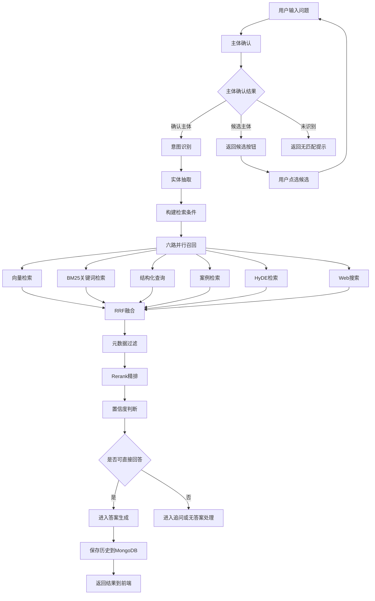
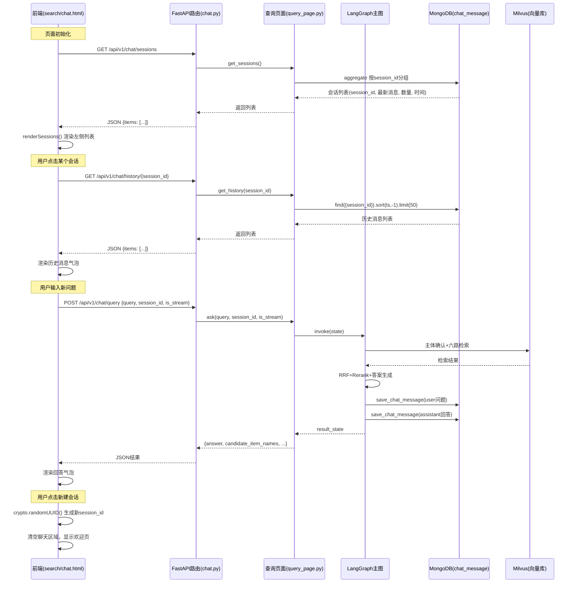

# 多路混合检索流程

> 流程编号：FLOW-02-01 | 版本：v1.4 | 更新时间：2026-06-14

**流程说明**：本流程为在线检索核心链路。入口为主体确认阶段，有确认/候选/未识别三种分流；确认后进入六路并行召回，召回后进入 RRF 融合、元数据过滤、Rerank 与置信度判断阶段。

---

## Typora 兼容版流程图

---

## 会话管理流程

---

## 主体确认阶段说明

主体确认是整个检索链路的入口，决定后续是否继续检索。

### 三种分流逻辑

| 情况 | 条件 | state 变化 | 后续行为 |
|---|---|---|---|
| 确认主体 | Milvus 命中 score >= 0.55 | `item_names` = 确认列表 | 继续进入意图识别 → 六路检索 |
| 候选主体 | 0.45 < score < 0.55 | `candidate_item_names` = 候选列表 | 返回候选按钮，等待用户点选 |
| 未识别 | score <= 0.45 或无结果 | `answer` = 无匹配提示 | 提前返回，不进入检索 |

### 候选确认流程

1. 用户提问，系统进入主体确认
2. Milvus 检索到中等分数的匹配项（0.45~0.55）
3. 后端返回 `candidate_item_names` 列表和提示文案
4. 前端渲染可点击的候选按钮
5. 用户点击某个候选按钮
6. 前端将候选名 + 原始问题重新提交
7. 重新进入主体确认，此时 LLM 会直接识别出确认主体
8. 正常进入后续检索链路

### 代码位置

- 服务：`app/rag/query/item_name_confirm_service.py`
- 节点：`app/process/query/agent/nodes/node_item_name_confirm.py`
- 主图分流：`app/process/query/agent/main_graph.py`（`node_item_name_confirm_after`）
- 前端候选按钮：`app/resources/html/chat.html`（`buildCandidateButtons`）
- 前端候选按钮：`frontend/search.html`（`buildCandidateButtons`）

### 阈值配置

- 确认阈值：`CONFIRM_THRESHOLD = 0.55`
- 候选阈值：`CANDIDATE_THRESHOLD = 0.45`
- 位置：`app/rag/query/item_name_confirm_service.py`

---

## 六路检索说明

### 1. 向量检索
- 文件：`app/rag/query/embedding_search_service.py`
- 作用：基于 dense+sparse 混合向量从 Milvus 召回语义最相关的 chunks
- 适合：口语化、模糊表达、语义近似问题

### 2. BM25 关键词检索
- 文件：`app/rag/query/keyword_search_service.py`
- 作用：根据关键词命中次数做精确匹配召回
- 适合：故障码、术语、政策关键字、部件名

### 3. 结构化查询
- 文件：`app/rag/query/structured_query_service.py`
- 作用：从 MongoDB 文档元数据中检索车型、文档类型、版本等结构化信息
- 适合：按主体、车型、文档类型精准筛文档

### 4. 案例检索
- 文件：`app/rag/query/case_search_service.py`
- 作用：优先召回带"案例 / 故障 / 维修 / 处理"特征的知识内容
- 适合：维修经验、处理案例、相似故障现象查询

### 5. HyDE 检索
- 文件：`app/rag/query/hyde_search_sevice.py`
- 作用：先让 LLM 生成假设性答案，再拿假设答案去做向量检索
- 适合：复杂问题、描述抽象的问题

### 6. Web 搜索
- 文件：`app/rag/query/web_search_service.py`
- 作用：引入外部实时信息，补充本地知识库没有的时效内容
- 适合：最新政策、公开网页资料、外部更新信息

---

## 融合与后处理阶段

### RRF 融合
- 文件：`app/rag/query/rrf_service.py`
- 作用：将六路召回结果统一打分、去重、排序
- 当前实现：只融合非空路由，避免空路拖垮结果

### 元数据过滤
- 文件：`app/rag/query/metadata_filter_service.py`
- 作用：根据实体抽取结果中的车型、文档类型等条件，对 RRF 结果做过滤或降权

### Rerank
- 文件：`app/rag/query/rerank_service.py`
- 作用：对融合后的候选结果做精排，动态截断 TopK
- 当前建议：先使用本地 reranker，稳定后再评估线上服务

### 置信度判断
- 文件：`app/rag/query/confidence_service.py`
- 作用：根据 Top 结果分数和主体识别情况判断是否需要追问

---

## 当前代码中的真实顺序

1. `item_name_confirm_service.py`（有确认/候选/未识别三种分流）
2. `intent_recognition_service.py`（仅确认主体后进入）
3. `entity_extraction_service.py`
4. 六路召回（04~09）
5. `rrf_service.py`
6. `metadata_filter_service.py`
7. `rerank_service.py`
8. `confidence_service.py`
9. `prompt_builder.py`
10. `answer_service.py`
11. `qa_persist_service.py`

---

*流程版本：v1.4 | 更新时间：2026-06-14*
