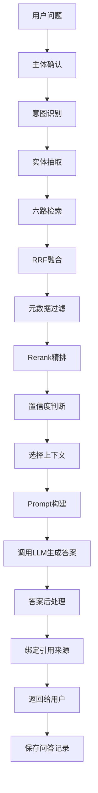

# RAG 生成回答流程

> 流程编号：FLOW-02-02 | 版本：v1.2 | 更新时间：2026-06-13

---

## Typora 兼容版流程图

---

## 生成阶段对应实现

### 1. Prompt 构建
- 文件：`app/rag/query/prompt_builder.py`
- 输入：`reranked_docs`、`history`、`item_names`、`rewritten_query`
- 输出：最终传给 LLM 的 prompt

### 2. 答案生成
- 文件：`app/rag/query/answer_service.py`
- 能力：
  - 支持流式生成
  - 支持非流式生成
  - 支持在低置信度时返回追问

### 3. 置信度处理
- 文件：`app/rag/query/confidence_service.py`
- 作用：在进入答案生成前决定：
  - 是否直接回答
  - 是否加追问
  - 是否提示资料不足

### 4. 问答持久化
- 文件：`app/rag/query/qa_persist_service.py`
- 作用：保存问答内容、上下文和答案结果

---

## Prompt 组成建议（当前框架）

当前建议 Prompt 由以下四部分组成：

1. 参考上下文
2. 历史对话
3. 主体名称
4. 改写后的用户问题

对应模板文件：
- `app/resources/prompts/answer_out.prompt`

---

## 当前代码链路（生成相关）

1. `rrf_service.py`
2. `metadata_filter_service.py`
3. `rerank_service.py`
4. `confidence_service.py`
5. `prompt_builder.py`
6. `answer_service.py`
7. `qa_persist_service.py`

---

*流程版本：v1.2 | 更新时间：2026-06-13*
