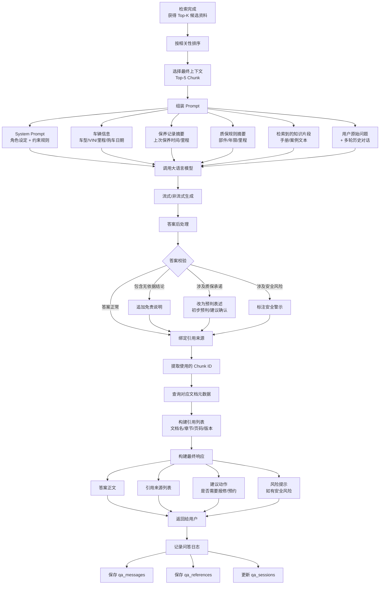

# RAG 生成回答流程

> 流程编号：FLOW-02-02 | 版本：v1.0 | 更新时间：2026-06-12

---

## 完整流程图



---

## Prompt 模板设计

### System Prompt（固定）

```
你是比亚迪商用车售后智能助手，负责基于企业内部知识库回答售后服务相关问题。

【核心约束】
1. 只能基于【参考资料】中的内容回答，不得编造政策、参数、配置或维修步骤
2. 参考资料不足时，明确告知"当前资料中未找到足够依据，建议联系授权服务站确认"
3. 涉及质保结论时，使用"初步预判"表述，提示最终以服务站检测为准
4. 涉及安全风险时（高压系统/制动故障/电池热失控等），必须在答案开头明确警示
5. 不得给出"保修""不保修"的最终结论，只能给出预判和建议

【输出格式】
- 第一行：直接结论（1-2句）
- 主体：依据说明（引用参考资料，说明来源）
- 结尾：注意事项 / 建议动作（如有风险或需人工确认）
```

### User Prompt 模板

```python
USER_PROMPT_TEMPLATE = """
【用户问题】
{question}

【车辆信息】
- 车型：{vehicle_model}
- VIN：{vin}
- 购车日期：{purchase_date}
- 当前里程：{current_mileage} km

【最近保养记录】
{maintenance_summary}

【参考资料】
{context}

请根据以上信息回答用户问题：
"""
```

### Context 格式

```python
def format_context(chunks: list) -> str:
    context_parts = []
    for i, chunk in enumerate(chunks, 1):
        meta = chunk.get("metadata", {})
        part = f"""【资料{i}】来源：{meta.get('doc_name', '未知')} / {meta.get('section_title', '')} / 第{meta.get('page_no', '?')}页（版本：{meta.get('version', '?')}，生效：{meta.get('effective_date', '?')}）
{chunk['chunk_text']}"""
        context_parts.append(part)
    return "\n\n".join(context_parts)
```

---

## 答案引用溯源展示格式

前端展示时，答案下方需展示引用卡片：

```
📄 参考来源 1
文档：T5轻卡质保手册 v1.0
章节：三电系统质保说明（第18页）
生效时间：2026-01-01
原文片段："动力电池质保期限为5年或20万公里（以先到者为准）……"
```

---

*流程版本：v1.0 | 更新时间：2026-06-12*
