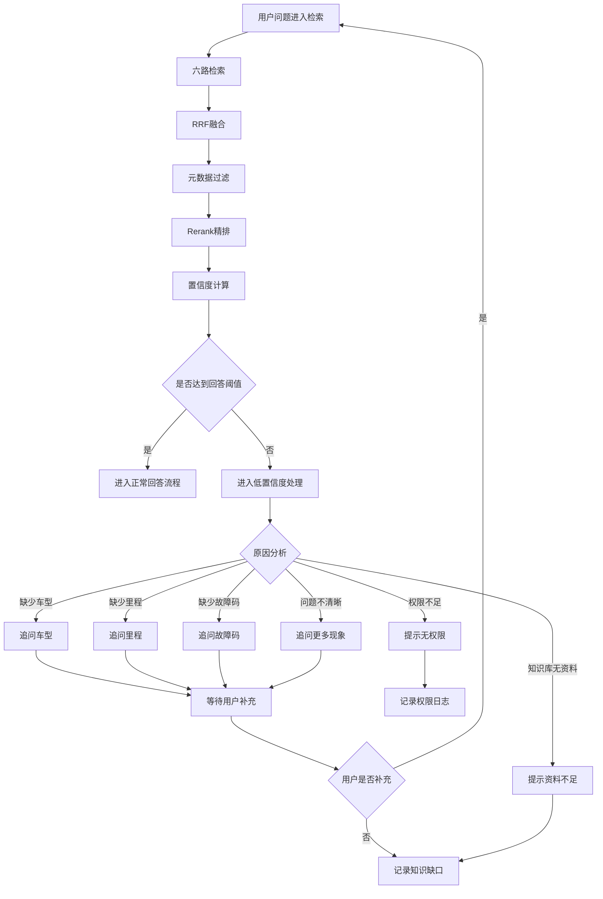

# 无答案与补充提问流程

> 流程编号：FLOW-02-03 | 版本：v1.1 | 更新时间：2026-06-13

**流程说明**：当检索结果置信度不足时，系统不应强行生成答案，而应进入追问、提示资料不足、或知识缺口记录流程。

---

## Typora 兼容版流程图

---

## 当前代码对应关系

- 置信度判断：`app/rag/query/confidence_service.py`
- 答案生成：`app/rag/query/answer_service.py`
- Prompt 构建：`app/rag/query/prompt_builder.py`

---

## 当前追问策略可增强的方向

1. 追问原因分类更细
   - 当前主要基于分数和是否识别主体
   - 后续可以细分为车型缺失、文档类型缺失、案例信息缺失等

2. 追问话术更自然
   - 区分故障问题、保养问题、质保问题
   - 根据意图返回不同追问模板

3. 知识缺口记录更结构化
   - 记录缺口类别
   - 记录触发问题
   - 记录最大召回分数
   - 记录建议补充方向

---

*流程版本：v1.1 | 更新时间：2026-06-13*
