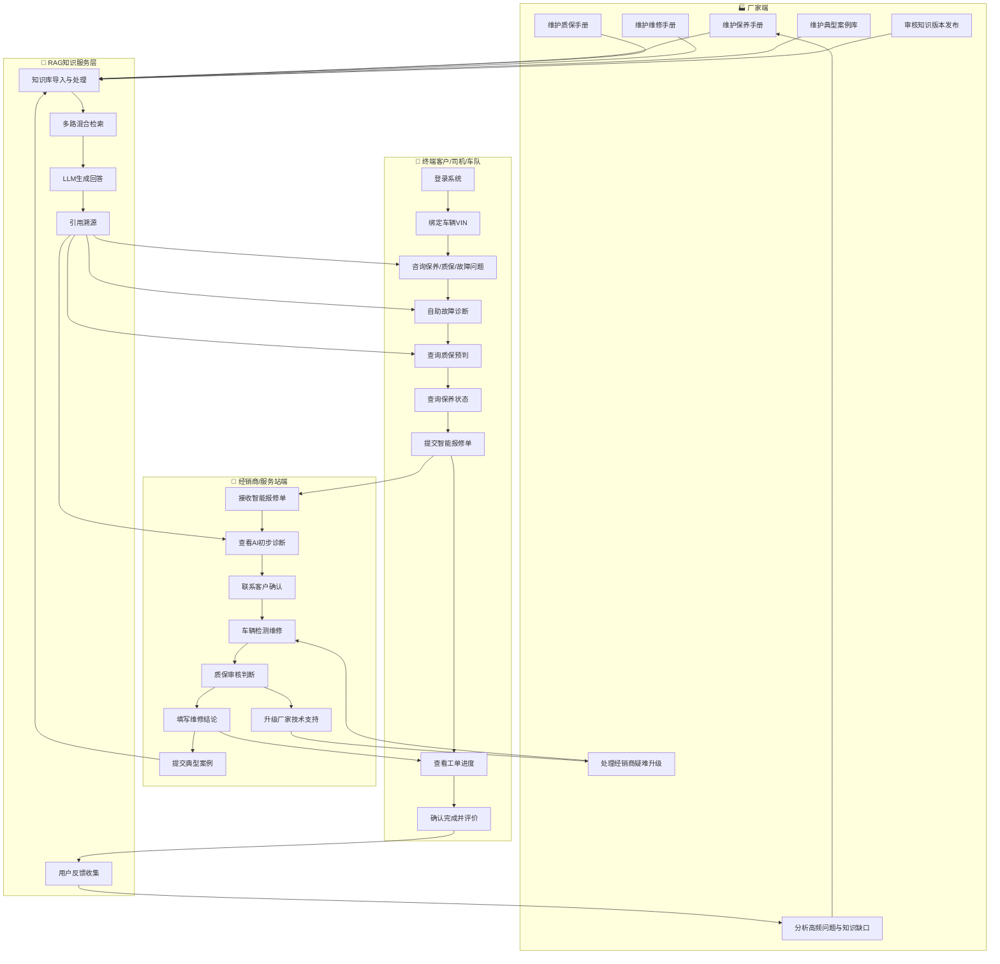

# 整体业务架构流程

> 流程编号：FLOW-03-01 | 版本：v1.0 | 更新时间：2026-06-12

**流程说明**：展示厂家、经销商/服务站、终端客户三类角色的协同关系与完整业务闭环。

---

## 整体业务架构流程图



---

## 三角色协同说明

| 角色 | 核心职责 | 与 RAG 系统的关系 |
|---|---|---|
| **厂家** | 提供权威知识、审核发布、处理疑难、分析优化 | 知识输入方，负责知识库质量 |
| **经销商/服务站** | 接单维修、质保判断、案例沉淀 | 知识使用方 + 知识生产方（维修案例） |
| **终端客户** | 咨询诊断、报修、评价 | 知识消费方，反馈驱动优化 |

---

## 完整业务闭环

```
厂家知识输入
    ↓
RAG 知识处理（解析/切分/向量化）
    ↓
终端客户智能问答与诊断
    ↓
质保预判 + 智能报修
    ↓
经销商维修处理
    ↓
维修案例沉淀
    ↓
知识库持续更新
    ↓（循环）
```

---

*流程版本：v1.0 | 更新时间：2026-06-12*
