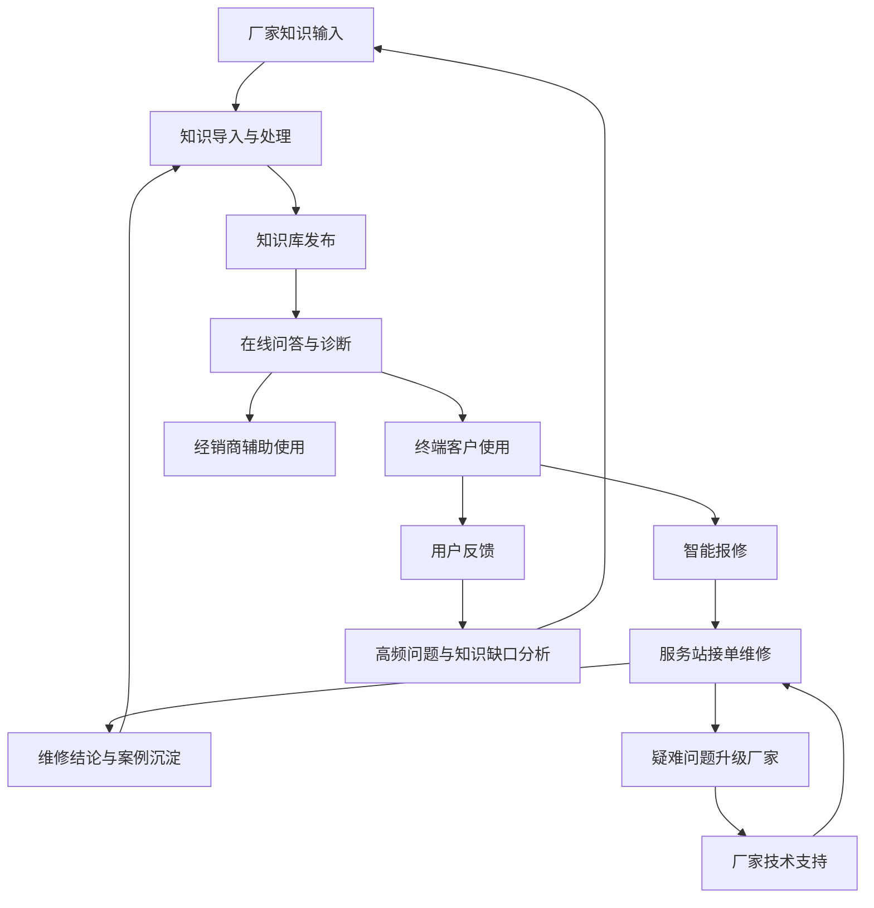

# 整体业务架构流程

> 流程编号：FLOW-03-01 | 版本：v1.1 | 更新时间：2026-06-13

**流程说明**：展示厂家、经销商/服务站、终端客户三类角色的协同关系与完整业务闭环。

---

## 整体业务架构流程图

---

## 三角色协同说明

| 角色 | 核心职责 | 与 RAG 系统的关系 |
|---|---|---|
| 厂家 | 提供权威知识、审核发布、处理疑难、分析优化 | 知识输入方，负责知识质量 |
| 经销商/服务站 | 接单维修、质保判断、案例沉淀 | 知识使用方 + 案例生产方 |
| 终端客户 | 咨询诊断、报修、评价 | 知识消费方，反馈驱动优化 |

---

## 完整业务闭环

1. 厂家维护手册、质保政策、维修资料、案例知识
2. 系统完成导入、切分、向量化、入库、发布
3. 客户发起咨询、诊断、质保/保养判断
4. 客户触发智能报修
5. 服务站接单处理并形成维修结论
6. 典型案例重新沉淀到知识库
7. 厂家根据反馈修补知识缺口

---

*流程版本：v1.1 | 更新时间：2026-06-13*
