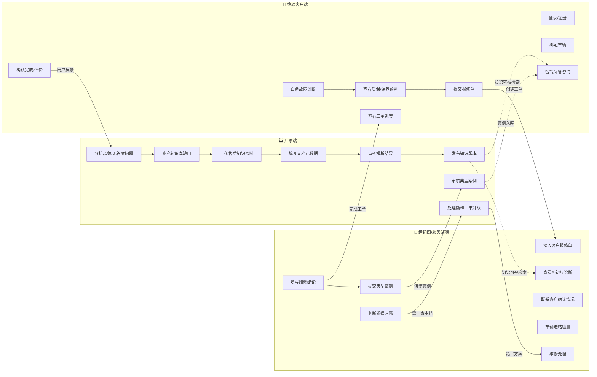

# 角色分工流程

> 流程编号：FLOW-03-02 | 版本：v1.0 | 更新时间：2026-06-12

---

```mermaid
flowchart LR
    subgraph Factory["🏭 厂家端"]
        F1[上传售后知识资料]
        F2[填写文档元数据]
        F3[审核解析结果]
        F4[发布知识版本]
        F5[审核典型案例]
        F6[处理疑难工单升级]
        F7[分析高频/无答案问题]
        F8[补充知识库缺口]
    end

    subgraph Dealer["🔧 经销商/服务站端"]
        D1[接收客户报修单]
        D2[查看AI初步诊断]
        D3[联系客户确认情况]
        D4[车辆进站检测]
        D5[判断质保归属]
        D6[维修处理]
        D7[填写维修结论]
        D8[提交典型案例]
    end

    subgraph Customer["👤 终端客户端"]
        C1[登录/注册]
        C2[绑定车辆]
        C3[智能问答咨询]
        C4[自助故障诊断]
        C5[查看质保/保养预判]
        C6[提交报修单]
        C7[查看工单进度]
        C8[确认完成/评价]
    end

    F1 --> F2 --> F3 --> F4
    F4 -.->|知识可被检索| C3
    F4 -.->|知识可被检索| D2
    F5 -.->|案例入库| C3

    C4 --> C5 --> C6
    C6 -->|创建工单| D1
    D7 --> D8
    D8 -->|沉淀案例| F5
    D5 -->|需厂家支持| F6
    F6 -->|给出方案| D6
    D7 -->|完成工单| C7
    C8 -->|用户反馈| F7
    F7 --> F8 --> F1
```

---

*流程版本：v1.0 | 更新时间：2026-06-12*
