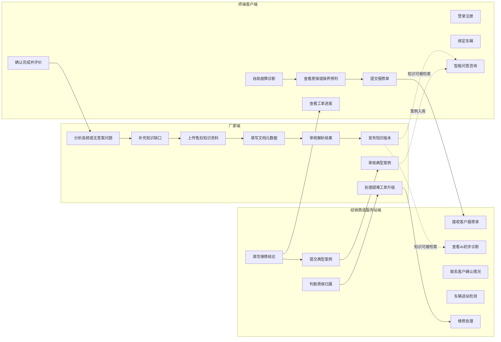

# 角色分工流程

> 流程编号：FLOW-03-02 | 版本：v1.1 | 更新时间：2026-06-13

---

## 角色分工流程图

---

## 角色职责概览

- 厂家端：知识维护、版本发布、疑难支持、知识优化
- 经销商/服务站端：接单维修、质保审核、维修案例沉淀
- 终端客户端：咨询、诊断、报修、进度查询、评价反馈

---

*流程版本：v1.1 | 更新时间：2026-06-13*
