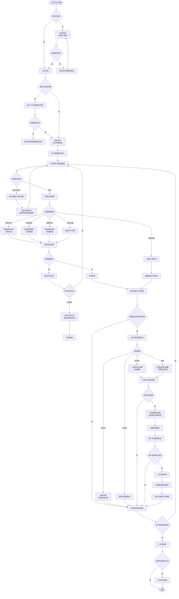

# 终端客户业务主流程

> 流程编号：FLOW-03-03 | 版本：v1.0 | 更新时间：2026-06-12

**流程说明**：终端客户从登录到反复提问、无答案处理，到最终报修或结束会话的完整业务主流程。

---

## 完整业务主流程图

---

## 关键节点说明

### C-01 登录/注册
- 支持手机号+密码、短信验证码两种方式
- 首次使用需注册，注册后自动进入绑定车辆引导

### C-02 绑定车辆
- 通过 VIN（车架号）精确绑定
- VIN 不在系统中时，引导联系经销商，不能绑定不存在的车辆
- 一个账号可绑定多辆车

### C-03 发起咨询
- 输入框支持文字描述
- 可选：上传图片、输入故障码
- 系统展示问题示例引导用户描述清晰

### 风险等级建议动作

| 风险等级 | 显示样式 | 建议动作 |
|---|---|---|
| 低风险 | 🟢 绿色 | 可继续使用，参考自查步骤 |
| 中风险 | 🟡 黄色 | 尽快预约服务站检查 |
| 高风险 | 🔴 红色 | 停止使用，立即联系服务站 |
| 紧急 | 🆘 红色闪烁 | 立即停车，拨打救援热线 |

---

*流程版本：v1.0 | 更新时间：2026-06-12*
