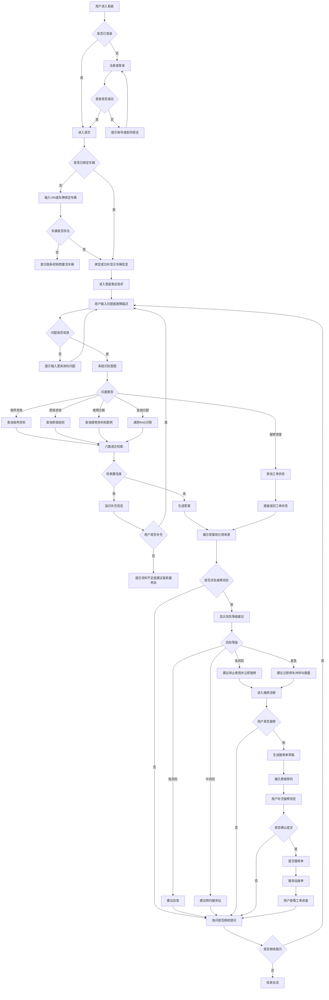

# 终端客户业务主流程

> 流程编号：FLOW-03-03 | 版本：v1.1 | 更新时间：2026-06-13

**流程说明**：终端客户从登录、绑定车辆、提问、检索问答、故障风险判断，到报修与结束的完整主流程。

---

## 完整业务主流程图

---

## 风险等级建议动作

| 风险等级 | 显示样式 | 建议动作 |
|---|---|---|
| 低风险 | 绿色 | 可继续使用，参考自查步骤 |
| 中风险 | 黄色 | 尽快预约服务站检查 |
| 高风险 | 红色 | 停止使用，立即联系服务站 |
| 紧急 | 红色高亮 | 立即停车，拨打救援热线 |

---

## 关键节点说明

1. 登录后必须先完成车辆绑定，才能进入更准确的售后问答
2. 问题有效后进入意图识别与检索链路
3. 低置信度问题进入追问或资料不足处理
4. 高风险或紧急问题可直接引导报修
5. 用户可以在会话中多轮继续追问

---

*流程版本：v1.1 | 更新时间：2026-06-13*
