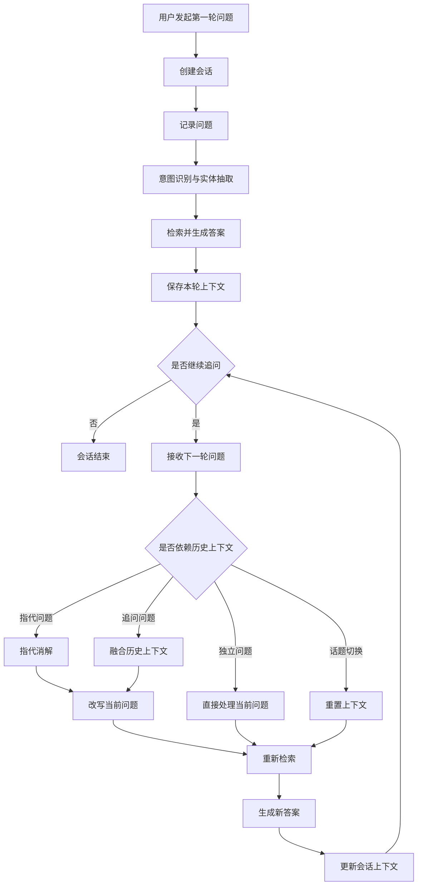

# 多轮对话上下文流程

> 流程编号：FLOW-03-04 | 版本：v1.1 | 更新时间：2026-06-13

**流程说明**：用户连续追问时，系统需要保留上下文、识别指代关系和话题切换，避免每一轮都从零开始检索。

---

## 多轮对话流程图

---

## 典型场景

### 1. 指代消解
- 用户先问：`T5轻卡动力电池质保几年？`
- 用户再问：`那超过里程但没超时间呢？`
- 系统需要把“那”还原为上一轮的动力电池质保问题

### 2. 追问深入
- 用户先问：`6万公里需要做哪些保养？`
- 用户再问：`其中换润滑油大概多少费用？`
- 系统需要沿用上一轮上下文继续检索

### 3. 话题切换
- 用户先问故障问题
- 接着说：`另外我想问一下保养周期`
- 系统应识别为新话题并重置主要检索上下文

---

## 上下文窗口管理策略

| 策略 | 说明 |
|---|---|
| 保留最近 5 轮 | 超过 5 轮的历史做摘要压缩 |
| 关键实体持久化 | 车型、VIN、里程、故障码尽量跨轮保留 |
| 话题切换重置 | 检测到明显切换词时重置检索主上下文 |
| 超时自动结束 | 会话长时间无活动后自动结束 |

---

*流程版本：v1.1 | 更新时间：2026-06-13*
