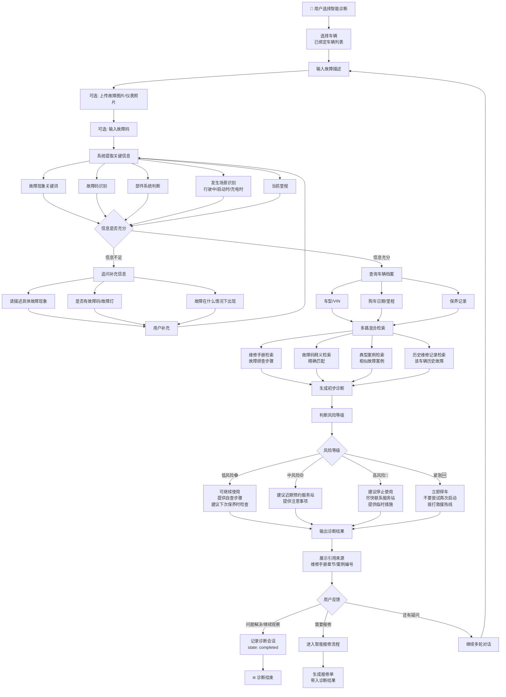

# 智能诊断流程

> 流程编号：FLOW-03-05 | 版本：v1.0 | 更新时间：2026-06-12

**流程说明**：用户描述车辆故障后，系统结合维修手册、典型案例、车辆档案进行综合诊断，输出初步诊断建议和风险等级。

---

## 完整智能诊断流程图



---

## 风险等级判断规则

| 风险等级 | 触发条件示例 | 建议动作 |
|---|---|---|
| 🟢 低风险 | 异响但不影响驾驶、空调制冷略弱 | 自查 + 保养时检查 |
| 🟡 中风险 | 动力轻微下降、偶发故障灯 | 7天内预约服务站 |
| 🔴 高风险 | 无法启动、制动异常、电池告警 | 停止使用，立即报修 |
| 🆘 紧急 | 电池热失控、制动失灵、冒烟冒火 | 立即停车，拨打救援 |

---

## 诊断结果输出格式

```json
{
  "session_id": "DS10001",
  "risk_level": "high",
  "risk_label": "高风险 - 建议停止使用",
  "possible_causes": [
    "低压电瓶电量不足，导致高压系统无法上电（概率：高）",
    "高压互锁回路异常（概率：中）",
    "挡位传感器信号异常（概率：低）"
  ],
  "suggestion": "建议停止使用，不要强行启动，立即联系服务站或拨打救援电话",
  "self_check_steps": null,
  "action_recommendation": "repair",
  "references": [
    {
      "doc_name": "T5轻卡维修手册",
      "section": "动力系统故障排查 - 无法启动",
      "page": 56
    },
    {
      "case_no": "CASE20260601001",
      "case_title": "T5轻卡无法启动-DC-DC故障案例"
    }
  ]
}
```

---

*流程版本：v1.0 | 更新时间：2026-06-12*
