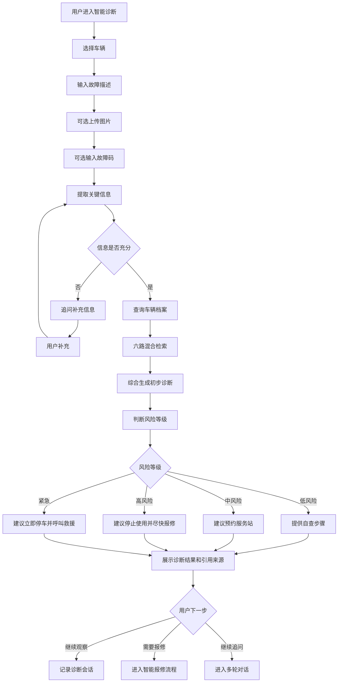

# 智能诊断流程

> 流程编号：FLOW-03-05 | 版本：v1.1 | 更新时间：2026-06-13

**流程说明**：用户描述故障后，系统结合维修手册、案例、车辆信息进行综合诊断，输出初步结论和风险等级建议。

---

## 完整智能诊断流程图

---

## 风险等级规则示意

| 风险等级 | 触发条件示例 | 建议动作 |
|---|---|---|
| 低风险 | 异响但不影响驾驶 | 自查 + 保养时检查 |
| 中风险 | 动力轻微下降、偶发故障灯 | 近期预约服务站 |
| 高风险 | 无法启动、制动异常、电池告警 | 停止使用，立即报修 |
| 紧急 | 电池热失控、制动失灵、冒烟 | 立即停车，拨打救援 |

---

## 诊断输出建议结构

1. 风险等级
2. 可能原因列表
3. 建议动作
4. 是否可继续使用
5. 引用来源

---

*流程版本：v1.1 | 更新时间：2026-06-13*
