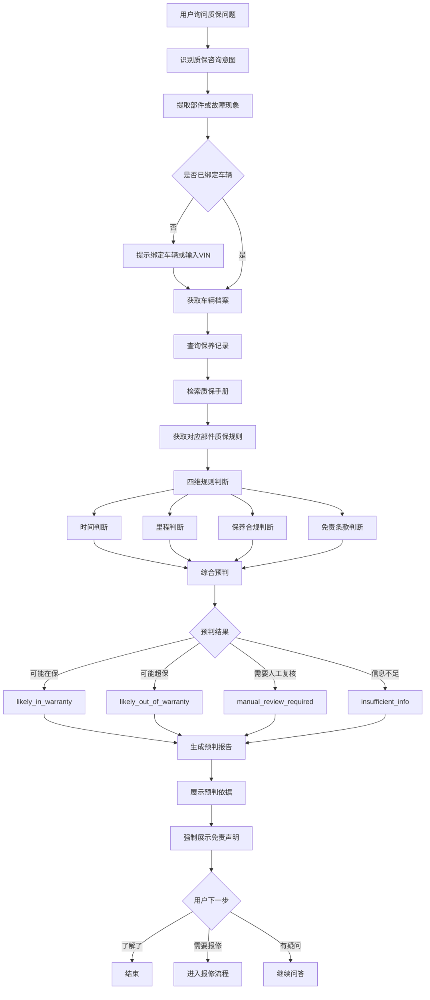

# 质保预判流程

> 流程编号：FLOW-03-06 | 版本：v1.1 | 更新时间：2026-06-13

**流程说明**：质保预判不是单纯大模型回答，而是 RAG 检索、结构化信息查询和规则判断的组合结果。输出永远是“初步预判”，不是最终质保结论。

---

## 质保预判完整流程图

---

## 四维判断说明

1. 时间维度：是否超过质保年限
2. 里程维度：是否超过质保里程上限
3. 保养维度：是否按规定周期完成保养
4. 免责维度：故障描述是否触发免责情形

---

## 预判结果展示原则

| 结果值 | 展示含义 |
|---|---|
| `likely_in_warranty` | 初步判断可能在保 |
| `likely_out_of_warranty` | 初步判断可能超保 |
| `manual_review_required` | 需要人工复核 |
| `insufficient_info` | 信息不足，无法判断 |

**原则**：只展示“可能 / 初步判断”，不展示绝对结论。

---

*流程版本：v1.1 | 更新时间：2026-06-13*
