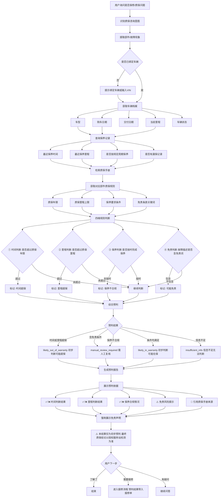

# 质保预判流程

> 流程编号：FLOW-03-06 | 版本：v1.0 | 更新时间：2026-06-12

**流程说明**：质保预判是"RAG知识检索 + 结构化业务查询 + 规则引擎"三者结合的综合判断，不是单纯的大模型回答。系统输出的是**初步预判**，最终质保结论以服务站检测为准。

---

## 质保预判完整流程图



---

## 四维判断代码示例

```python
from datetime import datetime, timedelta
from enum import Enum

class WarrantyPreCheckResult(str, Enum):
    LIKELY_IN_WARRANTY = "likely_in_warranty"
    LIKELY_OUT_OF_WARRANTY = "likely_out_of_warranty"
    MANUAL_REVIEW_REQUIRED = "manual_review_required"
    INSUFFICIENT_INFO = "insufficient_info"

def warranty_precheck(vehicle: dict, component: str, fault_description: str) -> dict:
    """
    四维质保预判：
    1. 时间维度：是否超过质保年限
    2. 里程维度：是否超过质保里程
    3. 保养维度：是否按规定周期保养
    4. 免责维度：故障描述是否触发免责条款
    """
    
    # 获取质保规则
    rules = get_warranty_rules(vehicle["vehicle_model"], component)
    if not rules:
        return {"result": WarrantyPreCheckResult.INSUFFICIENT_INFO, "reason": "未找到对应质保规则"}
    
    issues = []
    details = {}
    
    # ① 时间判断
    purchase_date = vehicle["purchase_date"]
    warranty_expire = purchase_date + timedelta(days=rules["warranty_years"] * 365)
    time_ok = datetime.now() < warranty_expire
    details["time"] = {
        "ok": time_ok,
        "purchase_date": str(purchase_date),
        "warranty_expire": str(warranty_expire),
        "days_remaining": (warranty_expire - datetime.now()).days if time_ok else 0
    }
    if not time_ok:
        issues.append("超过质保年限")
    
    # ② 里程判断
    current_mileage = vehicle.get("current_mileage", 0)
    mileage_ok = current_mileage < rules["warranty_mileage"]
    details["mileage"] = {
        "ok": mileage_ok,
        "current": current_mileage,
        "limit": rules["warranty_mileage"],
        "km_remaining": rules["warranty_mileage"] - current_mileage if mileage_ok else 0
    }
    if not mileage_ok:
        issues.append("超过质保里程")
    
    # ③ 保养判断
    maintenance_ok = check_maintenance_compliance(vehicle["_id"], rules)
    details["maintenance"] = {"ok": maintenance_ok}
    if not maintenance_ok:
        issues.append("保养记录不合规")
    
    # ④ 免责判断
    exclusion_risk = any(kw in fault_description for kw in rules.get("exclusion_keywords", []))
    details["exclusion"] = {"risk": exclusion_risk}
    if exclusion_risk:
        issues.append("故障描述含可能免责情形")
    
    # 综合判断
    if "超过质保年限" in issues or "超过质保里程" in issues:
        result = WarrantyPreCheckResult.LIKELY_OUT_OF_WARRANTY
    elif issues:  # 有保养问题或免责风险
        result = WarrantyPreCheckResult.MANUAL_REVIEW_REQUIRED
    else:
        result = WarrantyPreCheckResult.LIKELY_IN_WARRANTY
    
    return {
        "result": result,
        "issues": issues,
        "details": details,
        "disclaimer": "本结果仅为初步预判，最终质保结论以授权服务站检测结果为准"
    }
```

---

## 预判结果展示说明

| 预判结果 | 展示文案 | 颜色 |
|---|---|---|
| `likely_in_warranty` | ✅ 初步判断：车辆可能在质保范围内 | 绿色 |
| `likely_out_of_warranty` | ⚠️ 初步判断：车辆可能已超出质保范围 | 橙色 |
| `manual_review_required` | 🔍 需要人工复核：请联系服务站确认 | 黄色 |
| `insufficient_info` | ❓ 信息不足：无法给出预判 | 灰色 |

> ⚠️ **产品设计原则**：预判结果只展示"可能"、"初步判断"，永远不展示"确定保修"或"确定不保修"。强制展示免责声明："本结果仅供参考，最终质保结论以授权服务站检测结果为准。"

---

*流程版本：v1.0 | 更新时间：2026-06-12*
