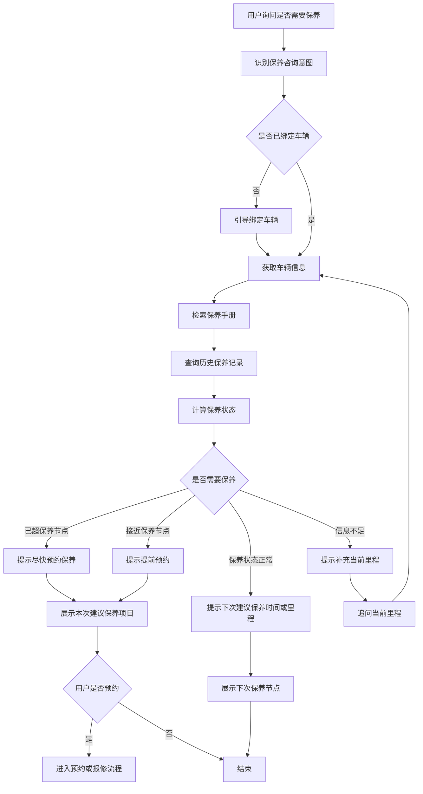

# 保养判断流程

> 流程编号：FLOW-03-07 | 版本：v1.1 | 更新时间：2026-06-13

---

## 完整流程图

---

## 判断规则示意

| 状态 | 含义 |
|---|---|
| `overdue` | 已超过建议保养节点 |
| `due_soon` | 即将到达保养节点 |
| `normal` | 当前保养状态正常 |
| `unknown` | 信息不足，无法判断 |

---

## 核心判断依据

1. 当前里程
2. 最近一次保养里程
3. 最近一次保养时间
4. 车型对应的保养周期规则

---

*流程版本：v1.1 | 更新时间：2026-06-13*
