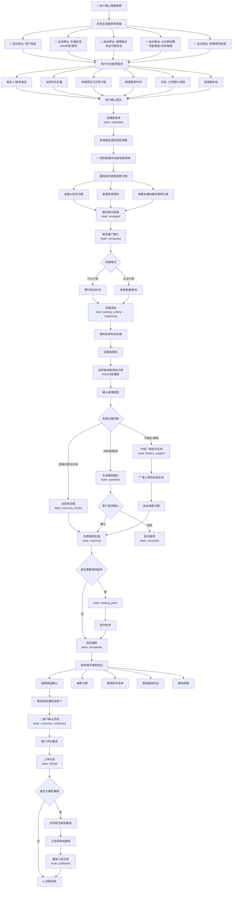

# 智能报修完整流程

> 流程编号：FLOW-03-08 | 版本：v1.0 | 更新时间：2026-06-12

**流程说明**：从用户确认需要报修，到经销商受理、维修处理、工单关闭的端到端完整流程，覆盖三类角色协同。

---

## 完整智能报修流程图

---

## 报修单自动带出字段说明

系统自动带出的信息来源：

| 字段 | 来源 | 说明 |
|---|---|---|
| 用户信息 | 登录账号 | 姓名、手机号 |
| 车辆信息 | vehicles 集合 | VIN、车型、里程、购车日期 |
| 故障描述 | diagnosis_sessions | 用户输入的故障现象 |
| AI 诊断结果 | diagnosis_sessions | 可能原因、风险等级 |
| 质保预判 | 质保预判接口 | 时间/里程/保养状态判断 |

用户只需要补充：联系信息、位置、是否可行驶、期望时间、服务站选择。大幅减少手动填写负担。

---

## 报修单关键状态说明

| 状态 | 操作方 | 触发时机 |
|---|---|---|
| `submitted` | 用户提交 | 用户点击确认报修 |
| `accepted` | 服务顾问 | 服务站受理工单 |
| `inspecting` | 系统/技师 | 车辆到站开始检测 |
| `warranty_review` | 服务顾问 | 需要判断是否属于质保 |
| `repairing` | 技师 | 开始维修 |
| `completed` | 技师 | 维修完成 |
| `closed` | 系统 | 客户确认 + 评价完成 |

---

*流程版本：v1.0 | 更新时间：2026-06-12*
