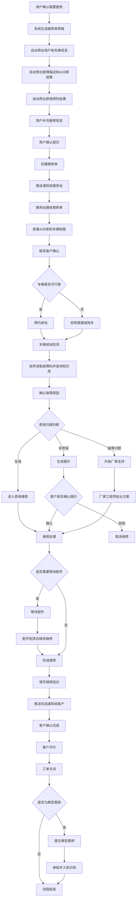

# 智能报修完整流程

> 流程编号：FLOW-03-08 | 版本：v1.1 | 更新时间：2026-06-13

**流程说明**：从用户确认需要报修，到系统生成工单草稿、服务站受理、维修处理、工单关闭的完整流程。

---

## 完整智能报修流程图

---

## 报修单自动带出字段

| 字段 | 来源 |
|---|---|
| 用户信息 | 登录账号 |
| 车辆信息 | 车辆档案 |
| 故障描述 | 诊断会话 |
| AI 诊断结果 | 诊断结果 |
| 质保预判 | 质保预判接口 |

---

## 关键状态说明

| 状态 | 触发时机 |
|---|---|
| `submitted` | 用户确认报修 |
| `accepted` | 服务站受理 |
| `inspecting` | 车辆到站开始检测 |
| `warranty_review` | 判断质保归属 |
| `repairing` | 开始维修 |
| `completed` | 维修完成 |
| `closed` | 客户确认完成 |

---

*流程版本：v1.1 | 更新时间：2026-06-13*
