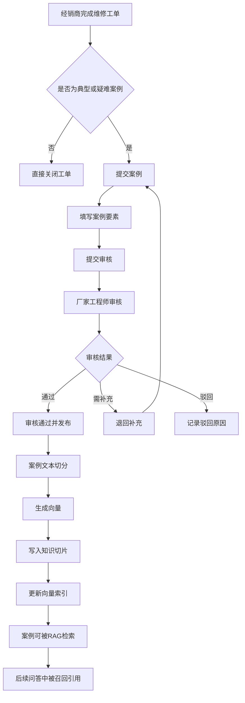

# 案例沉淀流程

> 流程编号：FLOW-03-09 | 版本：v1.1 | 更新时间：2026-06-13

**流程说明**：将经销商完成维修后的典型案例沉淀回知识库，形成问答系统的持续优化闭环。

---

## 完整案例沉淀流程图

---

## 案例结构建议

案例内容建议包含 4 个部分：
1. 故障现象
2. 原因分析
3. 处理方案
4. 经验总结

---

## 案例质量标准

| 评审维度 | 要求 |
|---|---|
| 故障现象 | 具体，包含故障码和发生场景 |
| 原因分析 | 说明根因，不只是表面现象 |
| 处理方案 | 步骤清晰，可复现 |
| 经验总结 | 有规律总结或预防建议 |
| 车型明确 | 明确适用车型 |
| 隐私脱敏 | VIN 和个人信息需脱敏 |

---

*流程版本：v1.1 | 更新时间：2026-06-13*
