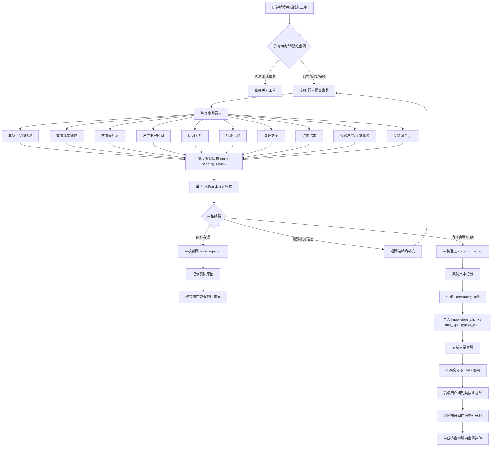

# 案例沉淀流程

> 流程编号：FLOW-03-09 | 版本：v1.0 | 更新时间：2026-06-12

**流程说明**：将经销商完成的维修工单中的典型案例，经过审核后沉淀回知识库，形成 RAG 系统的持续知识更新闭环。

---

## 完整案例沉淀流程图



---

## 案例四段式结构规范

提交案例时应遵循以下结构，便于系统切分和检索：

```markdown
## 故障现象
车辆无法启动，低压电瓶正常，仪表上电但无法 READY，故障码 P0A0F/P1D00。

## 原因分析
DC-DC 转换器内部电容老化失效，导致低压侧供电异常（输出电压仅 8V，正常应为 14V），
整车控制器因低压供电不足无法完成 READY 流程。

## 处理方案
1. 检查 DC-DC 输出电压（万用表测量 B+ 端）
2. 确认 DC-DC 控制器连接器无松动/腐蚀
3. 更换 DC-DC 转换器总成
4. 清除整车故障码
5. 验证车辆正常启动并试驾 10km

## 经验总结
T5 车型在 5~8 万公里区间 DC-DC 故障率相对较高，建议在该里程保养时增加
DC-DC 输出电压检查项（正常值：14V±0.5V）。此类故障外观症状容易与低压
电瓶故障混淆，需注意区分。
```

---

## 案例质量标准

| 评审维度 | 要求 |
|---|---|
| 故障现象 | 描述具体，包含仪表状态、故障码、发生场景 |
| 原因分析 | 说明根本原因，不只是"部件损坏" |
| 处理方案 | 步骤清晰，可复现操作 |
| 经验总结 | 有预防建议或规律性发现 |
| 车型明确 | 明确适用车型 |
| 隐私脱敏 | VIN 脱敏，不含客户个人信息 |

---

*流程版本：v1.0 | 更新时间：2026-06-12*
