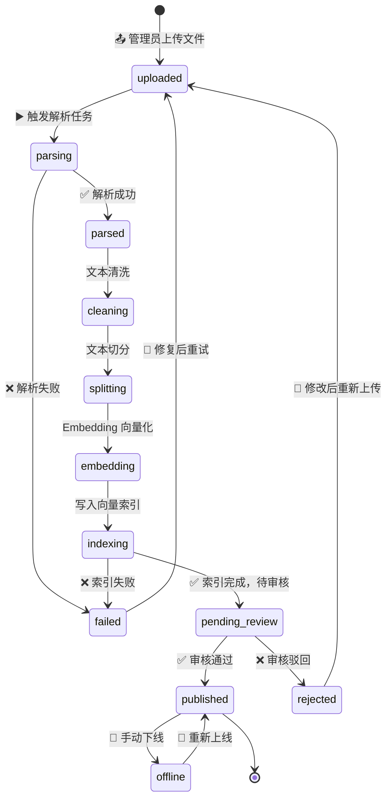
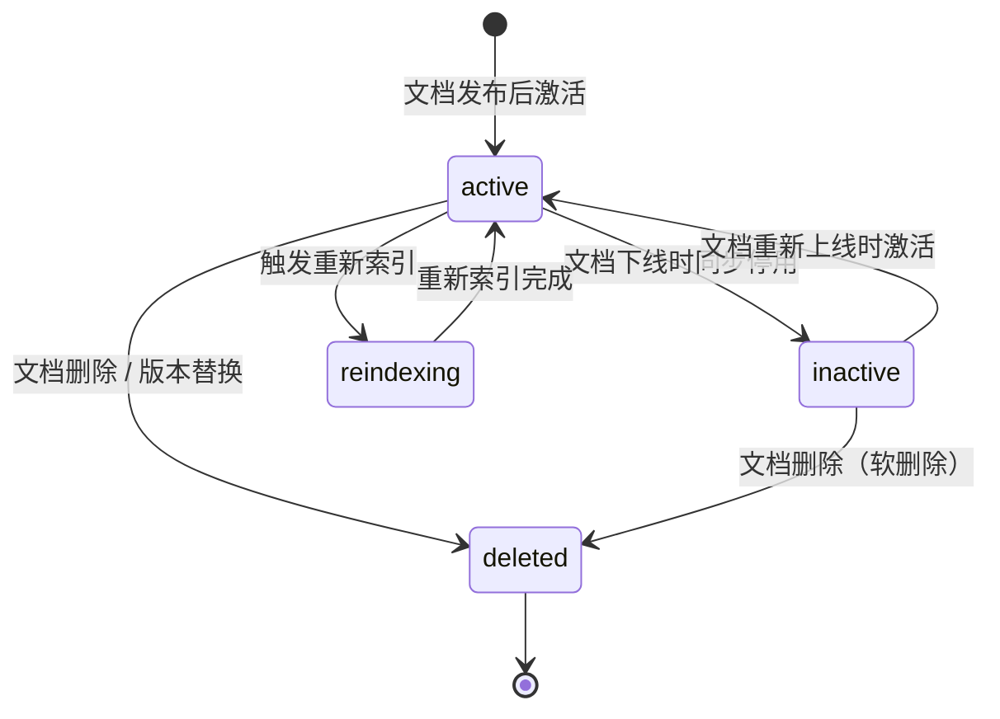

# 知识文档状态流转

> 流程编号：FLOW-04-01 | 版本：v1.0 | 更新时间：2026-06-12

---

## 知识文档完整状态流转图



---

## Chunk 状态流转图



---

## 状态变更触发规则

| 触发操作 | 文档状态变化 | Chunk 状态变化 |
|---|---|---|
| 上传文件 | → `uploaded` | — |
| 触发解析 | → `parsing` | — |
| 解析成功 | → `parsed` | — |
| 处理完成（索引完成） | → `pending_review` | 批量创建，`inactive` |
| 审核通过/发布 | → `published` | 批量 `inactive` → `active` |
| 审核驳回 | → `rejected` | 批量删除 |
| 手动下线 | → `offline` | 批量 `active` → `inactive` |
| 重新上线 | → `published` | 批量 `inactive` → `active` |
| 文档删除 | → 物理删除 | 批量 `deleted` |
| 新版本上传 | 旧文档 → `offline` | 旧 Chunk → `deleted` |

---

## 版本管理设计

当同一文档发布新版本时：

```python
async def publish_new_version(new_doc_id: str, doc_name: str, vehicle_model: str, doc_type: str):
    """
    发布新版本时的处理逻辑：
    1. 找到同类文档的旧版本
    2. 将旧版本文档状态设为 offline
    3. 将旧版本 Chunks 标记为 deleted
    4. 将新版本文档状态设为 published
    5. 将新版本 Chunks 激活为 active
    """
    # 下线旧版本
    old_docs = await db.knowledge_documents.find({
        "doc_name": doc_name,
        "vehicle_model": vehicle_model,
        "doc_type": doc_type,
        "state": "published",
        "_id": {"$ne": new_doc_id}
    }).to_list(None)
    
    for old_doc in old_docs:
        await db.knowledge_documents.update_one(
            {"_id": old_doc["_id"]},
            {"$set": {"state": "offline"}}
        )
        await db.knowledge_chunks.update_many(
            {"doc_id": str(old_doc["_id"])},
            {"$set": {"state": "deleted"}}
        )
    
    # 激活新版本
    await db.knowledge_documents.update_one(
        {"_id": new_doc_id},
        {"$set": {"state": "published", "published_at": datetime.now()}}
    )
    await db.knowledge_chunks.update_many(
        {"doc_id": new_doc_id, "state": "inactive"},
        {"$set": {"state": "active"}}
    )
```

---

*流程版本：v1.0 | 更新时间：2026-06-12*
