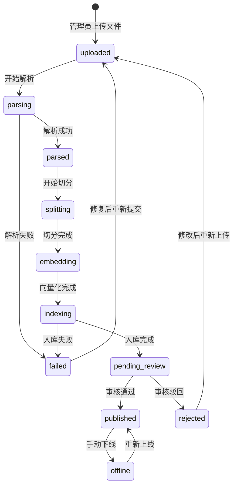
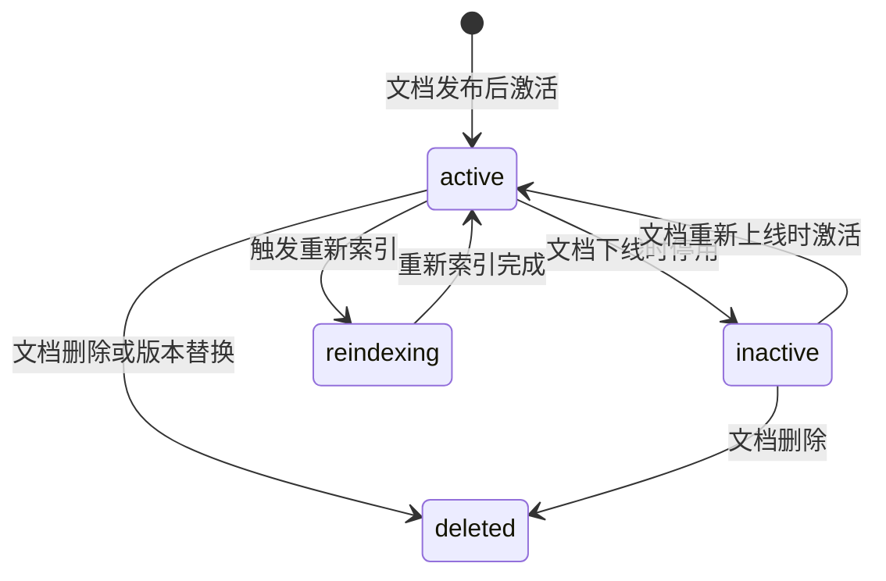

# 知识文档状态流转

> 流程编号：FLOW-04-01 | 版本：v1.1 | 更新时间：2026-06-13

---

## 知识文档完整状态流转图

---

## Chunk 状态流转图

---

## 状态变更触发规则

| 触发操作 | 文档状态变化 | Chunk 状态变化 |
|---|---|---|
| 上传文件 | → `uploaded` | — |
| 触发解析 | → `parsing` | — |
| 解析成功 | → `parsed` | — |
| 完成切分/向量化/入库 | → `pending_review` | 批量创建 |
| 审核通过/发布 | → `published` | 批量激活 |
| 审核驳回 | → `rejected` | 不参与检索 |
| 手动下线 | → `offline` | `active` → `inactive` |
| 重新上线 | → `published` | `inactive` → `active` |
| 文档删除 | 逻辑删除或物理删除 | 批量 `deleted` |
| 新版本上传 | 旧版本转 `offline` | 旧 Chunk 转 `deleted` |

---

## 版本管理设计说明

当同一文档存在新版本时，推荐流程：
1. 先查找旧版本已发布文档
2. 将旧版本文档状态改为 `offline`
3. 将旧版本 chunk 标记为 `deleted`
4. 将新版本文档状态改为 `published`
5. 将新版本 chunk 激活为 `active`

---

*流程版本：v1.1 | 更新时间：2026-06-13*
