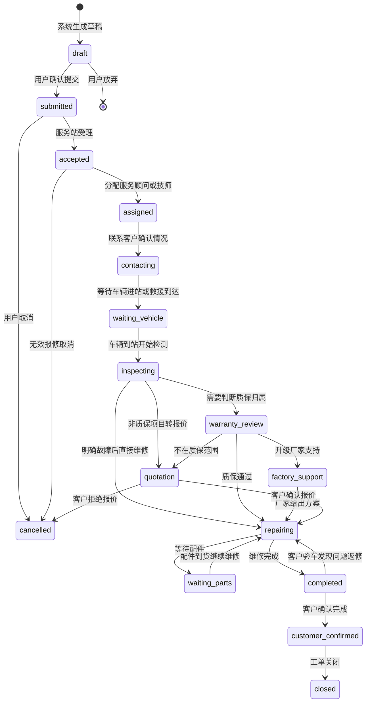

# 报修单状态流转

> 流程编号：FLOW-04-02 | 版本：v1.1 | 更新时间：2026-06-13

---

## 报修单状态流转图

---

## 状态详情表

| 状态值 | 中文名 | 操作方 | 说明 |
|---|---|---|---|
| `draft` | 草稿 | 系统 | 自动生成，未提交 |
| `submitted` | 已提交 | 终端客户 | 用户确认提交 |
| `accepted` | 已受理 | 服务顾问 | 服务站确认接单 |
| `assigned` | 已派单 | 服务顾问 | 指定负责技师 |
| `contacting` | 联系中 | 服务顾问/技师 | 与客户确认情况 |
| `waiting_vehicle` | 等待车辆 | 系统 | 等待进站或救援 |
| `inspecting` | 检测中 | 维修技师 | 实际检测车辆 |
| `warranty_review` | 质保审核 | 服务顾问/工程师 | 判断质保归属 |
| `factory_support` | 厂家支持中 | 售后工程师 | 升级至厂家技术支持 |
| `quotation` | 报价中 | 服务顾问 | 非质保项目给客户报价 |
| `repairing` | 维修中 | 维修技师 | 执行维修操作 |
| `waiting_parts` | 等待配件 | 服务站 | 配件缺货等待 |
| `completed` | 维修完成 | 维修技师 | 等待客户验车确认 |
| `customer_confirmed` | 客户已确认 | 终端客户 | 客户验车通过 |
| `closed` | 已关闭 | 系统 | 工单全流程完成 |
| `cancelled` | 已取消 | 客户/服务站 | 中途取消报修 |

---

## 通知规则示意

| 状态变更 | 通知对象 | 通知方式 |
|---|---|---|
| submitted → accepted | 用户 | 短信 + App 推送 |
| accepted → inspecting | 用户 | App 推送 |
| inspecting → quotation | 用户 | 短信 + App 推送 |
| quotation → repairing | 用户 | App 推送 |
| repairing → completed | 用户 | 短信 + App 推送 |
| completed → closed | 用户 | App 推送 |

---

*流程版本：v1.1 | 更新时间：2026-06-13*
